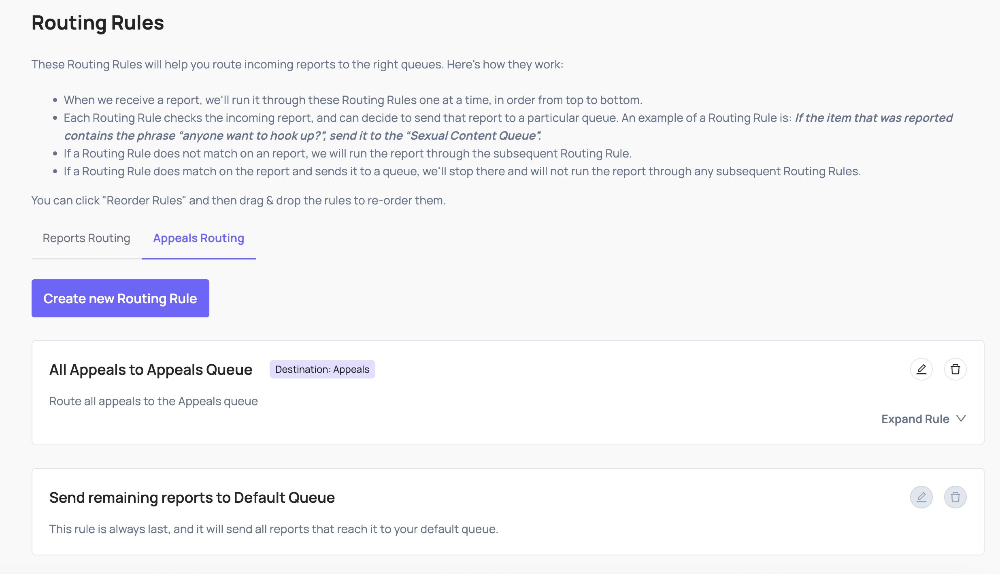

When a user on your platform is unsatisfied with your decision and submits an appeal request, asking you to re-review your original decision, you should send that appeal request to Coop through this API.

## Implementation

> [!NOTE]
> Before you implement the Appeal API integration, please first review the [Basic Concepts](CONCEPTS.html) and set up your [Item Types](CONCEPTS.html#item-type) and [Actions](CONCEPTS.html#actions)

To populate Appeals in your Review Queues, send Coop appealed decisions and create a routing rule.


 

When a user submits an appeal request, make a POST request to /api/v1/report/appeal. You'll have to [authenticate](ARCHITECTURE.md#authentication) the request and add the relevant parameters to the body of the request, as shown in our code examples below.

## REST API Examples

Below are some code snippets that you can paste directly into your code. You'll notice we're [authenticating the request](ARCHITECTURE.md#authentication) using your organization's API key in the HTTP headers.

### Example Request

```typescript
const body = {
  "appealId": "3cc76649-f99b-4ce2-b45f-4f40e7115e2a",
  "appealedBy": {
    "id": "abc123",
    "typeId": "def456"
  },
  "appealedAt": "2022-10-16 17:47:55.781-05",
  "actionedItem": {
    "id": "ghi789",
    "typeId": "jkl234",
    "data": {
      "text": "some text commented by a user",
      // ... all other fields in your Item Type
    }
  },
  "actionsTaken": [
    "mno654"
  ],
  "appealReason": "I dont believe this violates any site policies, but was taken down anyway",
  "additionalItems": [
    {
      "id": "hij123",
      "typeId": "jkl234",
      "data": {
        "text": "some post",
        // ... all other fields in your Item Type
      }
    },
    {
      "id": "rst567",
      "typeId": "jkl234",
      "data": {
        "text": "another post",
        // ... all other fields in your Item Type
      }
    },
  ],
  "violatingPolicies": [
    {
      id: "ghi789",
    },
    {
      id: "jkl321",
    }
  ],
};

const response = await fetch(
  "/api/v1/report/appeal",
  {
    method: 'post',
    body: JSON.stringify(body),
    headers: {
      "x-api-key": "<<apiKey>>",
      "Content-Type": "application/json"
    },
  }
);
console.log(response.status);
```

These are the fields that Coop expects in the body of the request:

| Property | Type | Required? | Description |
| :---- | :---- | :---- | :---- |
| appealId | String | Required | The internal ID that represents this appeal submission in your system. This will be propagated back to you when a moderator reviews the Appeal. |
| appealedBy | ItemIdentifier | Required | The user that reported the Item you're sending. See the ItemIdentifier schema below for details. This should include your internal user id, as well as the typeIdof the user item in Coop’s system. |
| appealedAt | Datetime | Required | The datetime indicating the exact time at which the appeal was submitted. Datetimes should be formatted as [ISO 8601](https://en.wikipedia.org/wiki/ISO_8601) strings. |
| actionedItem | Item | Required | The Item that was actioned. See the ActionedItem schema below for details. |
| appealReason | string | Optional | If you allow users to write additional free form text associated with the appeal to indicate why they're submitting the appeal, you can add that here. |
| actionsTaken | Array\<String> | Required | If the moderation action that led to this appeal came from Coop IDs of any actions that were taken and sent to your Action callback. |
| violatingPolicies | Array\<Policy> | Optional | If you received a list of Policies from the Action API when the initial moderation action was taken, you can include these here |
| additionalItems | Array\<Item> | Optional | If you want to render other pieces of content along with your report (e.g. the previous five posts made by the author of the reported content) for additional context, you can include those here in your report. |

Item schema:

| Property | Type | Required? | Description |
| :---- | :---- | :---- | :---- |
| id | String | Required | Your unique identifier for the Item that was actioned. |
| typeId | String | Required | The ID of the [Item Type](CONCEPTS.md#item-type) that corresponds to the Item being appealed. This should exactly match the ID of one of the [Item Types](CONCEPTS.md#item-type) that you defined in the Item Types page. |
| data | JSON | Required | This is a JSON containing the Item itself. In the Item Types page, you defined a schema for each Item Type. This data JSON must contain the fields you defined in the schema of the Item Type that corresponds to the reported Item. We'll return an error if any of the required fields are missing, if any of the types mismatch, or if any additional fields are included. Note: This is the same data JSON that you send Coop in the Item API. |

ItemIdentifier schema:

| Property | Type | Required? | Description |
| :---- | :---- | :---- | :---- |
| id | String | Required | Your unique identifier for the Item that is being reported. |
| typeId | String | Required | The ID of the [Item Type](CONCEPTS.md#item-type) that corresponds to the Item being reported. This should exactly match the ID of one of the Item Types that you defined in the Item Types page. |

Policy Schema

| Property | Type | Description |
| :---- | :---- | :---- |
| id | String | This is Coop’s unique identifier for this [Policy](CONCEPTS.md#policy). You can create, update, and view your company's Policies in the Policies page. If you click the "Edit" button on a particular Policy, you'll be able to see its id. |

### Example Response

Coop will respond with an HTTP response status code, which indicates whether the request was successful.

```json
{
    status: 204,
}
```

Successful requests will have a 204 status code.

# Appeal Decision Callback API

For every Appeal you moderate in Coop, you will receive the decision information through a public-facing API endpoint. Whenever a moderator accepts or rejects a user's appeal submission, Coop will send a POST request to your Appeal API endpoint. When your server receives that POST request, you may process that appeal decision internally and communicate the decision to the user.

Here's an example of a request Coop would send your Appeal API when an Appeal is accepted by a moderator on Coop

```json
{
  "appealId": "3cc76649-f99b-4ce2-b45f-4f40e7115e2a",
  "item": {
   "id": "ghi789",
   "typeId": "jkl234",
  },
  "appealedBy": {
   "id": "abc123",
    "typeId": "def456"
  },
  "appealDecision": "ACCEPT"
  "custom": {
    // ... any custom parameters that you configured in the Appeals Dashboard
  }
}
```

The Body of the Request will include the following:

| Property | Type | Always Present? | Description |
| :---- | :---- | :---- | :---- |
| item | Item | Always Present | The Item that originally received a moderation action, which was appealed by a user. |
| appealId | String | Always Present | The internal ID that you use to track this appeal, will correspond to an appeal ID sent to Coop via the Appeal API |
| appealedBy | ItemIdentifier | Always Present | The user that submitted this appeal, corresponding to the information send to Coop via the Appeal API. |
| appealDecision | ACCEPT/REJECT | Always present | The decision made by your moderator on this Appeal. "ACCEPT" meaning the original moderation action was incorrect, and the user appeal should be processed and accepted. "REJECT" meaning the original moderation action was correct, and does not need to be undone. |
| custom | Object | Not Always Present | If you would like Coop to include any custom parameters in the request Coop sends to your Appeal endpoint, you can add those custom parameters in the Appeal Configuration Form. These can be configured in the "Body" section of the form. |

#### Item Schema

| Property | Type | Description |
| :---- | :---- | :---- |
| id | String | Your unique identifier for this Item. You can use this ID to determine on which Item was originally moderated, leading to the user appeal. |
| typeId | String | The ID of the [Item Type](CONCEPTS.md#item-type) that corresponds to the Item which received a moderation action. This will exactly match the ID of one of the Item Types that you defined in the Item page. The IDs of each Item Type can be found in that dashboard |

#### ActionSchema

| Property | Type | Description |
| :---- | :---- | :---- |
| id | String | This is Coop’s unique identifier for this [Action](CONCEPTS.md#actions). You can create, update, and view your company's Actions in the Actions page. If you click the "Edit" button on a particular Action, you'll be able to see its id at the end of the URL. |