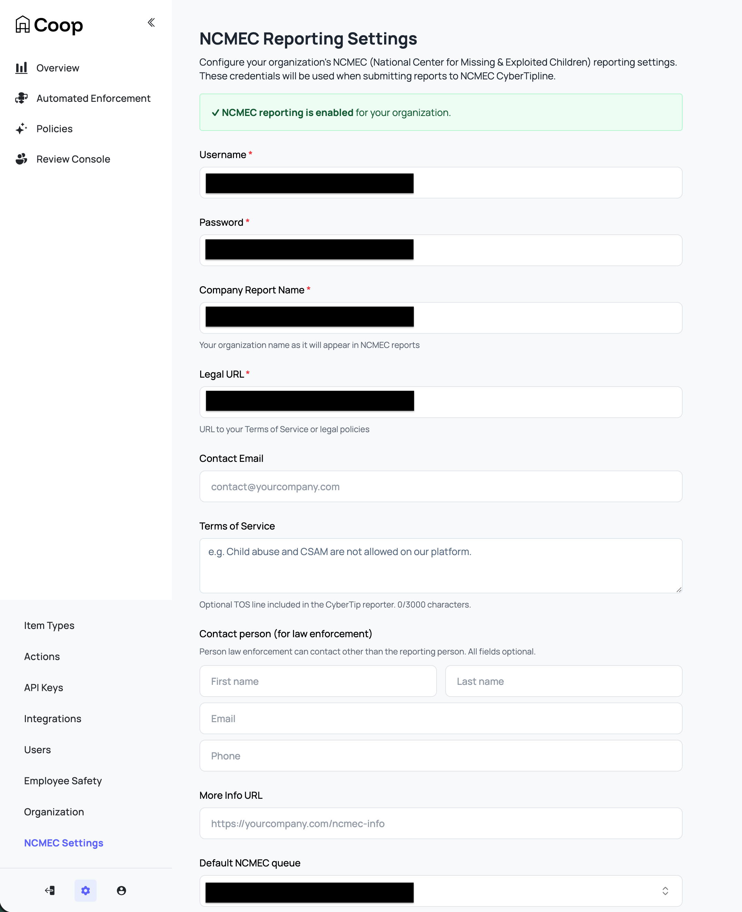
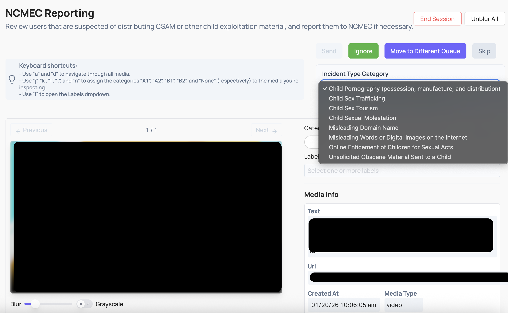

# NCMEC Reporting

Coop is integrated with the [CyberTipline Reporting API](https://report.cybertip.org/ispws/documentation) from the National Center for Missing and Exploited Children (NCMEC). Coop handles the full lifecycle: detecting known CSAM via hash matching or AI-based rules, routing content to a dedicated NCMEC manual review queue, and submitting CyberTips with the relevant metadata.

> [!IMPORTANT]
> NCMEC reporting requires your organization to be registered with NCMEC as an Electronic Service Provider (ESP). You can register at [esp.ncmec.org/registration](https://esp.ncmec.org/registration).

## Prerequisites

### CyberTip Reporting

Before you can review and report content to NCMEC, you must have the following configured:

1. **CyberTipline API credentials**: a username and password for the CyberTipline API, obtained from NCMEC.

#### Two separate sets of NCMEC credentials

Coop's NCMEC integration uses two different NCMEC APIs, each requiring its own credentials:

| | [Hash Sharing API](https://report.cybertip.org/ws-hashsharing/v2/documentation/) | [CyberTipline Reporting API](https://report.cybertip.org/ispws/documentation/index.html) |
|---|---|---|
| **Purpose** | Pull known CSAM hashes for matching | Submit CyberTip reports |
| **URL** | `report.cybertip.org/ws-hashsharing` | `report.cybertip.org/ispws` |
| **How to configure credentials** | In HMA's curator UI or via `TX_NCMEC_CREDENTIALS` env var on the HMA service | In Coop under **Settings → NCMEC** |

Both sets of credentials must be obtained from NCMEC by [registering as an ESP](https://esp.ncmec.org/registration). They may be the same account or different accounts depending on how NCMEC provisions access for your organization.

2. **A User Item Type with a `creatorId` field**: NCMEC-type jobs are centered on a user, not individual pieces of content. Coop extracts the user from a content item via a `creatorId` field (a `RELATED_ITEM` field referencing the User Item Type). Coop then aggregates all media associated with that user into a single NCMEC review job.

3. **NCMEC org settings configured**: set via **Settings → NCMEC** (Admin only). See [NCMEC Settings](#ncmec-settings) below.

4. **A dedicated NCMEC manual review queue named "NCMEC Review**: Coop routes NCMEC jobs to the queue specified in your NCMEC settings. Queue IDs that are registered as production queues with Coop support will submit real CyberTips; all others use the NCMEC test environment.

5. **An Additional Info endpoint** (optional, but strongly recommended): a webhook Coop calls before submitting a CyberTip to fetch enriched metadata: email addresses, screen names, IP capture events, and per-media details. Without this, Coop submits the CyberTip with only the user ID and basic information from the Item data.

6. **A Preservation endpoint** (optional): a webhook Coop calls after a successful CyberTip submission so your platform can preserve relevant user data per NCMEC requirements. NOTE: Coop does not come with built-in preservation functionalities.

### Hash Matching (HMA)

If you want to automatically detect known CSAM via hash matching, you need a **separate** set of credentials for NCMEC's Hash Sharing API — distinct from the CyberTipline credentials above. See [Hash Banks in the User Guide](/docs/USER_GUIDE.md#hash-banks) for more detailed setup. Both credential sets are obtained from NCMEC when registering as an ESP, but they authenticate against different APIs and are configured in different places: Hash Sharing credentials go into HMA's own configuration (its curator UI or the `TX_NCMEC_CREDENTIALS` env var on the HMA service), while CyberTipline credentials are configured in the Coop settings UI.

## NCMEC Settings

Configure NCMEC reporting under **Settings � NCMEC** (`/dashboard/settings/ncmec`).



| Setting | Description |
|--------|-------------|
| **Username** | Your NCMEC CyberTipline API username. |
| **Password** | Your NCMEC CyberTipline API password. |
| **Company Report Name** | Your organization name as it appears in NCMEC reports. This value is also sent as the ESP service name for the reported user in each CyberTip. |
| **Legal URL** | URL to your Terms of Service or legal policies (e.g. `https://yourcompany.com/terms`). |
| **Contact Email** | Email for the reporting person on the CyberTip. The XML receipt from NCMEC can serve as the ESP notification. |
| **Terms of Service** | TOS text or URL to an acceptable use policy relevant to the incident being reported. Maximum 3000 characters. |
| **Contact Person (for law enforcement)** | A contact person law enforcement can reach (other than the reporting contact email): first name, last name, email, phone. |
| **More Info URL** | URL for additional information about your reporting process (e.g. `https://yourcompany.com/ncmec-info`). Used as the web page URL when "Default internet detail type" is set to "Web page." |
| **Default NCMEC Queue** | When reviewers click "Enqueue to NCMEC," jobs are sent to this queue. Leave as "Use org default queue" to fall back to the organization's default queue. |
| **Default Internet Detail Type** | The incident context (channel/medium) included in every CyberTip: Web page, Email, Newsgroup, Chat/IM, Online gaming, Cell phone, Non-internet, or Peer-to-peer. |
| **NCMEC Additional Info Endpoint** | Webhook URL Coop calls before submitting a CyberTip to fetch enriched user and media metadata. See [Additional Info Endpoint](#additional-info-endpoint) below. Strongly recommended as without it, CyberTips are submitted with minimal user data. |
| **NCMEC Preservation Endpoint** | Webhook URL Coop calls after a successful CyberTip submission with the report ID. See [Preservation Endpoint](#preservation-endpoint) below. |

Saving credentials, Company Report Name, and Legal URL enables NCMEC reporting for the organization. The remaining fields are not required to submit a CyberTip, but filling them out makes reports significantly more actionable for NCMEC investigators.

## Access and Roles

NCMEC data is sensitive. Coop restricts access based on user roles:

| Role | Can Access NCMEC Jobs | Can Submit CyberTips | Can Configure NCMEC Settings |
|---|---|---|---|
| Admin | Yes | Yes | Yes |
| Moderator Manager | Yes | Yes | No |
| Child Safety Moderator | Yes | Yes | No |
| Moderator | No | No | No |
| Analyst / Rules Manager | No | No | No |
| External Moderator | No | No | No |

## How Content Gets Routed to the NCMEC Queue

There are four ways content can enter the NCMEC review queue:

### 1. Hash Matching Known CSAM (HMA)

Coop integrates with Meta's [Hasher-Matcher-Actioner (HMA)](https://github.com/facebook/ThreatExchange/tree/main/hasher-matcher-actioner), which matches uploaded media against NCMEC's database of known CSAM hashes. This is the most reliable detection path: a hash match is a strong signal that content is confirmed CSAM.

#### How it works

When media is submitted to your platform, Coop calls HMA to compute a perceptual hash (PDQ for images, MD5 for video) and checks it against the hash banks configured in HMA. If a match is found against an NCMEC-sourced bank, configure a routing rule to assign the content to your NCMEC review queue automatically.

HMA syncs hashes from NCMEC via NCMEC's [Hash Sharing API](https://report.cybertip.org/ws-hashsharing/v2/documentation/), a separate API from the CyberTipline reporting API. The Hash Sharing API gives you access to NCMEC's database of image and video fingerprints for known CSAM, which HMA pulls on a schedule and indexes locally for fast matching.

#### Setup

1. Configure NCMEC Hash Sharing API credentials in HMA (via HMA's curator UI or by setting the `TX_NCMEC_CREDENTIALS` environment variable on the HMA service).
2. In HMA, create a bank sourced from the NCMEC exchange. HMA will begin syncing hashes on its background fetch schedule (every 5 minutes by default).
3. In Coop, go to **Settings → Integrations** and add your HMA service URL.
4. In Coop's **Matching Banks**, the NCMEC-sourced bank will be available to reference in rules.
5. How you set things up depends on your use case:

* If items are submitted by user reports (`POST /api/v1/report`): create a routing rule with the NCMEC hash match logic and assign it to the NCMEC queue.

* If items are submitted via the items API `(POST /api/v1/items/async/)` and you want Coop to proactively flag matches without a user report: you need an automated enforcement rule with the image hash condition and a "Enqueue to NCMEC" action. 

 
### 2. Novel CSAM Detection (Content Safety API)

For content that hasn't been seen before and therefore has no known hash, Coop integrates with Google's Content Safety API that classifies images for potential CSAM. You can configure a Routing Rule using a Content Safety signal to route high-confidence detections directly to the NCMEC queue, or to a triage queue for human review before escalation.

### 3. Inbound Report Flagged as CSAM

When your platform sends a user report to Coop's Report API with `reportedForReason.csam: true`, Coop automatically routes it to the NCMEC queue instead of the default review queue. These reasons should be configured by your reporting flow and match whatever reporting reasons you have defined.

```json
{
  "reporter": { "id": "user123", "typeId": "user-type-id" },
  "reportedAt": "2025-01-01T00:00:00Z",
  "reportedItem": {
    "id": "content456",
    "typeId": "post-type-id",
    "data": { ... }
  },
  "reportedForReason": {
    "csam": true
  }
}
```

### 4. Manual Escalation from the Review Console

In any review task, moderators with NCMEC access can select **Enqueue to NCMEC** from the action list. This immediately moves the job out of the current queue and into the NCMEC queue.

### What Happens When Content Is Enqueued to NCMEC

When any of the three triggers above fire, Coop:

1. Identifies the **user** associated with the content (via the `creatorId` field on the content item, or directly if the item is a User type).
2. Checks whether that user already has an open NCMEC job. If one exists, the existing job is updated with the new payload (the new job's content always takes precedence). No duplicate jobs are created.
3. Fetches **all media** ever associated with that user across your platform.
4. Creates a single consolidated NCMEC review job containing the user and all their media.
5. Routes the job to the configured NCMEC queue (or the org default queue if none is configured).

This user-centric aggregation means that even if a user has uploaded many pieces of CSAM, a single NCMEC review job is created for the reviewer, and a single CyberTip is submitted to NCMEC rather than separate reports per piece of content.


## Reviewing an NCMEC Job

The NCMEC job UI is distinct from standard review tasks. It is designed around the user and all of their associated media.



### Incident Type

Select the applicable incident type from the NCMEC CyberTipline's defined categories:

- Child Pornography (possession, manufacture, and distribution)
- Child Sex Trafficking
- Child Sex Tourism
- Child Sexual Molestation
- Misleading Domain Name
- Misleading Words or Digital Images on the Internet
- Online Enticement of Children for Sexual Acts
- Unsolicited Obscene Material Sent to a Child

### Industry Classification

Apply an [ESP-designated industry classification](https://technologycoalition.org/wp-content/uploads/Tech_Coalition_Industry_Classification_System.pdf) to each media item being reported:

| Classification | Description |
|---|---|
| **A1** | Prepubescent minor, explicit sexual activity |
| **A2** | Prepubescent minor, non-explicit nudity or sexual posing |
| **B1** | Pubescent minor, explicit sexual activity |
| **B2** | Pubescent minor, non-explicit nudity or sexual posing |

Keyboard shortcuts are available in the review UI to speed up classification.

### File Annotations (Labels)

Apply one or more labels to individual media items to provide NCMEC with additional context:

| Label | Description |
|---|---|
| `animeDrawingVirtualHentai` | The file depicts anime, cartoon, virtual, or hentai content. |
| `potentialMeme` | The file appears to be shared out of mimicry or other seemingly non-malicious intent. |
| `viral` | The file is circulating rapidly from user to user. |
| `possibleSelfProduction` | The file is believed to be self-produced. |
| `physicalHarm` | The file depicts an intentional act of causing physical injury or trauma. |
| `violenceGore` | The file depicts graphic violence or brutality. |
| `bestiality` | The file involves an animal. |
| `liveStreaming` | The content was streamed live at the time it was uploaded. |
| `infant` | The file depicts an infant. |
| `generativeAi` | The file is believed to be generated by AI. |

### Submitting the CyberTip

Once the reviewer has classified all media and selected the incident type, they click **Submit to NCMEC**. Coop then builds and submits the CyberTip automatically. See [CyberTip Submission Flow](#cybertip-submission-flow) below.


## CyberTip Submission Flow

When a reviewer submits a CyberTip, Coop performs the following steps:

1. **Fetch additional info** — Coop calls your [Additional Info endpoint](#additional-info-endpoint) to retrieve enriched metadata: user email, screen name, IP capture events, and per-media details.

2. **Build the CyberTip XML** — Coop assembles the full report:

   - **escalateToHighPriority**: this is a boolean that marks the report as high priority (ie. there is abuse happening now) that NCMEC prioritizes when triaging. 
   - **Incident summary**: the incident type selected by the reviewer, and the timestamp of the most recently created media item as the `incidentDateTime`.

   - **Internet details**: the channel or medium of the incident (e.g. Web page, Chat/IM, Email), set via the "Default Internet Detail Type" in NCMEC org settings.

   - **Reporter**: your organization's name (`companyTemplate`), legal URL, contact email, optional terms of service language, and optional law enforcement contact person. All sourced from NCMEC org settings.

   - **Reported user (`personOrUserReported`)**: the suspected perpetrator. Coop includes:
     - `espIdentifier`: the user's internal platform ID
     - `espService`: your organization's name (from `companyTemplate`)
     - `screenName`: the user's username, from your Additional Info endpoint
     - `displayName`: the user's display name, if available
     - `email`: known email addresses for the user, from your Additional Info endpoint
     - `ipCaptureEvent`: IP addresses associated with the user (e.g. login, upload events), from your Additional Info endpoint. Providing IP data significantly improves NCMEC's ability to identify and locate the suspect.

   - **Victim**: if a child victim is identifiable (e.g. from a messaging context), Coop includes their `espIdentifier`, `screenName`, `displayName`, and `ipCaptureEvent`. This helps NCMEC locate and provide assistance to the victim.

3. **Submit the report**: Coop POSTs the report XML to the NCMEC CyberTipline API and receives a `reportId`.

4. **Upload media**: For each media item, Coop downloads the file from its URL and uploads it to NCMEC with full file metadata:
   - Industry classification (A1/A2/B1/B2)
   - File annotations (labels selected by the reviewer)
   - IP capture events associated with the upload
   - Whether the content was publicly available on your platform (`publiclyAvailable`)
   - Whether the ESP viewed the file and its EXIF data (`fileViewedByEsp: true`, `exifViewedByEsp: true`)
   - File hash, if provided by your Additional Info endpoint

5. **Upload supplemental files**: Any additional files returned by your Additional Info endpoint (e.g. screenshots, supporting evidence) are uploaded to NCMEC as supplemental reported files.

6. **Upload message threads**: If the user was reported in a messaging context, Coop generates a CSV for each conversation thread and uploads it to NCMEC.

7. **Finalize the report**: Coop calls the NCMEC `/finish` endpoint to complete the submission.

8. **Store the report**: The completed report (report ID, XML, all media details) is saved in Coop's database.

9. **Send a preservation request**: If your org has a [Preservation endpoint](#preservation-endpoint) configured, Coop calls it with the report ID so you can preserve relevant user data.

### Test vs. Production Submissions

Coop determines whether to submit to the NCMEC test environment or production based on whether the NCMEC queue is registered as a production queue with Coop support. Test submissions go to `exttest.cybertip.org`; production submissions go to `report.cybertip.org`.


## Webhooks

### Additional Info Endpoint

Coop calls this webhook **before** building a CyberTip to retrieve enriched metadata for the reported user and their media. This endpoint is optional but **strongly recommended** since without it, Coop submits the CyberTip with only the user's ID and whatever data was already sent to Coop via your Item API.

Coop signs every request with your org's signing key. Verify the signature before processing.

#### Request

```json
{
  "users": [
    { "id": "string", "typeId": "string" }
  ],
  "media": [
    { "id": "string", "typeId": "string" }
  ]
}
```

#### Response

```json
{
  "users": [
    {
      "id": "string",
      "typeId": "string",
      "screenName": "string",
      "email": [
        {
          "email": "user@example.com",
          "type": "Home",
          "verified": true,
          "verificationDate": "2025-01-01T00:00:00Z"
        }
      ],
      "ipCaptureEvent": [
        {
          "ipAddress": "192.0.2.1",
          "eventName": "Upload",
          "dateTime": "2025-01-01T00:00:00Z",
          "possibleProxy": false,
          "port": 443
        }
      ],
      "data": {}
    }
  ],
  "media": [
    {
      "id": "string",
      "typeId": "string",
      "missing": false,
      "publiclyAvailable": true,
      "fileName": "image.jpg",
      "additionalInfo": ["string"],
      "ipCaptureEvent": [
        {
          "ipAddress": "192.0.2.1",
          "eventName": "Upload",
          "dateTime": "2025-01-01T00:00:00Z",
          "possibleProxy": false,
          "port": 443
        }
      ],
      "fileDetails": {
        "hash": "abee9985862d273160d930d2ac6ddb2cc33c74e73c702bcc8183d235f6f9685a",
        "hashType": "PDQ"
      }
    }
  ],
  "additionalFiles": [
    {
      "fileUrl": "https://yourplatform.com/evidence/file.pdf",
      "fileName": "evidence.pdf",
      "additionalInfo": ["Supporting evidence"]
    }
  ],
  "messages": [
    { "id": "string", "typeId": "string", "ipAddress": "192.0.2.1" }
  ],
  "additionalInfo": "string"
}
```

#### Response Fields

| Field | Type | Description |
|---|---|---|
| `users` | Array | Must include an entry for every user in the request. |
| `users.id` | String | Must match the `id` from the request. |
| `users.typeId` | String | Must match the `typeId` from the request. |
| `users.screenName` | String | The user's screen name or username on your platform. |
| `users.email` | Array | Known email addresses for the user. `type` may be `Business`, `Home`, or `Work`. |
| `users.ipCaptureEvent` | Array | IP events associated with the user (e.g. logins, registrations). `eventName` may be `Login`, `Registration`, `Purchase`, `Upload`, `Other`, or `Unknown`. |
| `users.data` | Object | Raw item data for the user. |
| `media` | Array | Must include an entry for every media item in the request if present. |
| `media.id` | String | Must match the `id` from the request. |
| `media.typeId` | String | Must match the `typeId` from the request. |
| `media.missing` | Boolean | Set to `true` if the media is no longer available. If **all** media items are `missing: true`, no CyberTip is filed. |
| `media.publiclyAvailable` | Boolean | Whether the media was publicly accessible on your platform at the time of reporting. |
| `media.fileName` | String | Original filename of the media. |
| `media.additionalInfo` | Array\<String\> | Additional context about the media to include in the NCMEC file details. |
| `media.ipCaptureEvent` | Array | IP events associated with this media item (e.g. the upload event). |
| `media.fileDetails` | Object | Hash information for the file: `{ hash, hashType }`. |
| `additionalFiles` | Array | Extra files to upload to NCMEC as supplemental evidence (e.g. screenshots). |
| `messages` | Array | Message-level IP address data for conversation thread context. |
| `additionalInfo` | String | Top-level freeform additional information to include in the report. |

> [!IMPORTANT]
> If the response does not include an entry for every user and media item in the request, Coop will throw an error and not submit the CyberTip. Your endpoint must return a response entry for each requested user and media item. 
> If all media items have `missing: true`, Coop will not file the CyberTip. The job will be marked as a permanent error and will not be retried.


### Preservation Endpoint

Platforms that submit CyberTips may have data preservation obligations under laws like [18 U.S.C. § 
  2258A](https://uscode.house.gov/view.xhtml?req=granuleid:USC-prelim-title18-section2258A) and the [REPORT Act 
  (2024)](https://www.missingkids.org/blog/2024/first-line-of-defense-guidelines-to-help-online-platforms-detect-sexually-exploited-kids), which extended content retention
  requirements to one year. Talk to your legal team to understand your organization's specific obligations.

  Coop calls a preservation endpoint you build and host immediately after a CyberTip is successfully submitted. Your endpoint should trigger whatever internal workflow
  handles data retention — for example, flagging the account for legal hold, snapshotting relevant records, or notifying your legal team. Coop passes the reported user, the
  media included in the CyberTip, and the NCMEC-assigned report ID so you have everything you need to identify what to retain.
  Coop signs every request with your org's signing key. Verify the signature before processing.

#### Request

```json
{
  "user": { "id": "string", "typeId": "string" },
  "reportedMedia": [
    { "id": "string", "typeId": "string" }
  ],
  "reportId": "string"
}
```

| Field | Description |
|---|---|
| `user` | The user who was reported to NCMEC. |
| `reportedMedia` | All media items that were included in the CyberTip. |
| `reportId` | The NCMEC-assigned CyberTip report ID. |

Coop only checks for a successful HTTP status code. The response body is ignored. This webhook is only called for production (non-test) CyberTip submissions.


## Retry Behavior

If a CyberTip submission fails (e.g. due to a transient network error or NCMEC API outage), Coop automatically retries the submission. A background job runs periodically and retries any failed NCMEC decisions that:

* Have not already been successfully submitted (no matching report in the database)
* Have fewer than 10 prior retry attempts
* Are not marked as a permanent error (e.g. all media missing)
* Were decided within the past 30 days


## Viewing Submitted Reports

After a CyberTip is submitted, the report is stored in Coop and accessible from the NCMEC Reports dashboard. The report record includes:

* The NCMEC-assigned report ID
* The reported user
* All media included in the report
* The full CyberTip XML
* Any supplemental files uploaded
* Any conversation thread CSVs uploaded
* Whether the submission was a test or production report
