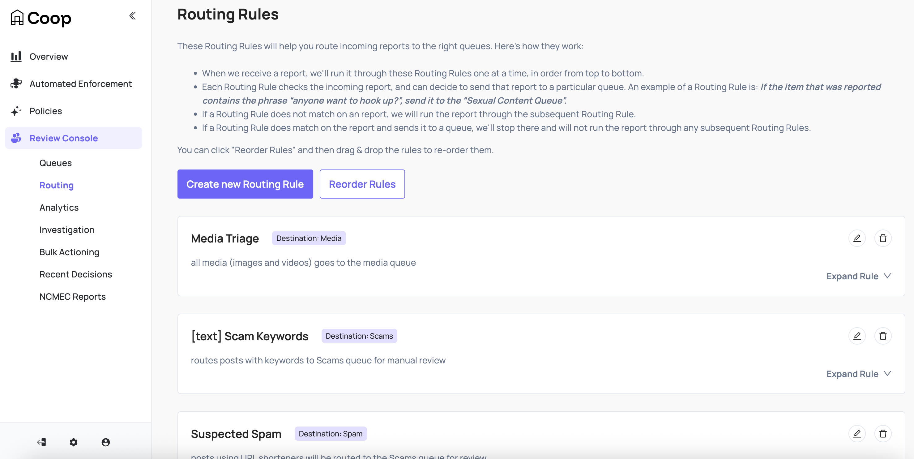
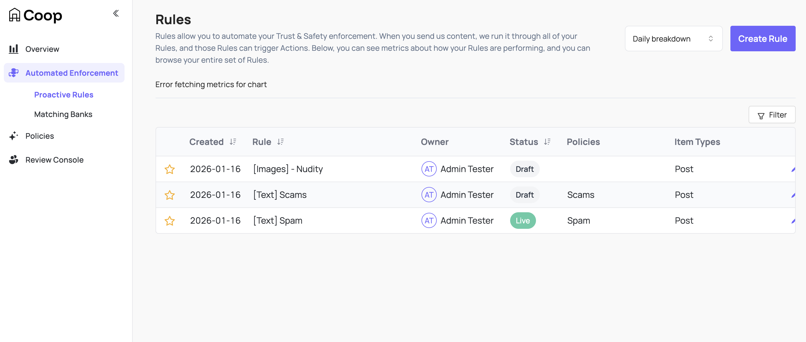

# Rules

Coop supports two types of rules. Each has separate code paths, storage tables, and UI surfaces.

1. **Routing rules:** First routing rule that succeeds routes the MRT bound event into the appropriate queue awaiting review, the rest are executed in order.  
2. **Automated Action rules:** All rules act in parallel on all events to determine auto actions and manual review decisioning

## Routing Rules

 

The first queue you create in Coop will be the “Default Queue”. All new tasks will be automatically added to that default Queue. Routing Rules triage incoming tasks and assign them to specific Queues. Any task that doesn’t match a routing rule goes to the Default Queue. 

Once you start adding other Queues, you'll need to decide which Jobs should be routed to your new Queues instead of going straight to the default Queue. The way you make those decisions is through Routing Rules. Routing Rules are pieces of logic that you configure in Coop's Routing Dashboard. 

## Automated Action Rules
 

An Automated Action Rule is a way to encode your moderation logic. For example, you might want to enforce the following moderation logic:  
*"if it contains the spam keywords 'example_word_1', 'example_word_2', or 'example_word_3'"  then delete the content".*

This can be especially useful when combatting automated abuse like scams, spam, or bot abuse. A Rule has a few components, and we'll break down the logic above into the relevant components. All of these components are easily configurable in the UI - there is no coding required, and the UI will walk you through it step by step.

1. **Item Type(s):** When you create a Rule, you need to decide which Item Types it will run on. In the example above, the Item Types for this Rule are Comment and Post, which you can tell from the phrase "For any Comment or Post". If you wanted to run this Rule on Profiles, DMs, or any other Item Type, you would just specify that you want the Rule to run on those additional Item Types.  
2. **Condition(s):** This is where you define the logic for how you want to moderate content. In the example above, the only Condition in this Rule is *"if it contains the slurs 'example_word_1', 'example_word_2', or 'example_word_3'".* A condition is just a piece of logic that can either be true or false for any given piece of content (i.e. for any Comment, it either contains one of those slurs, or it doesn't). You can create lots of different types of Conditions - some very simple, like this keyword-matching Condition, and some very complex, like a Condition that uses an AI model. You can read more about the types of [Signals](SIGNALS.md) you can use to construct these Conditions.  
3. **Action(s):** This is the Action (or Actions) that will be triggered if the Conditions above are met. 

### Automated Rule Statuses

Automated Action Rules can have four different "statuses":

1. **Live**: Live Rules are actively running on all incoming pieces of content, and they trigger Actions.  
2. **Background**: Background Rules are also actively running on all incoming pieces of content, but they are not triggering Actions. Instead, Coop just records which Items were caught by the Rule so you can inspect those Items later. Think of a "Background" Rule as a test or dry run - you can see what the Rule would catch without risking over-actioning on Items that shouldn't be actioned.  
3. **Draft**: Draft Rules are not running - they are merely partially constructed Rules that you can save and come back to later.  
4. **Archived**: Archived Rules are also not running, and they sit in a separate "Archived" folder. You can always un-archive a rule, but it can be useful to save deprecated rules for auditing purposes and posterity.

### Insights

In the Rule Insights page, you'll be able to see:

* The total number of Items that have matched the Rule every day  
* A large sample of real Items that have matched the Rule  
* If you click on one of the Items in the sample, you will see a full audit trail of why that Item matched the Rule and the result of each Condition in the Rule.

#### Testing an Automated Action Rule

Coop provides a way to test a rule from the Rule Insights page. You can enter specific words or data in the testing pop-out modal and see if it triggers a rule along with what matched the rule specifically.

## Waterfall Logic of Routing Rules

The core difference between Automated Rules and Routing Rules is that while Automated Rules are all executed in parallel, Routing Rules are executed in order. For example, let's say you have the following three Routing Rules:

* Rule 1: "If the Item on this task was reported by a user as Hate Speech, send this task to the Hate Speech Queue"  
* Rule 2: "If the Item on this task has Spanish text in it, send it to the Spanish Queue"  
* Rule 3: "Otherwise, send the task to the Default Queue"

For every incoming task, we'll run the task through the following logic:

* If the task matched Rule 1's criteria, (i.e. the Item was reported as Hate Speech), then Coop sends the task to the Hate Speech Queue, and the rules stop.  
* If the task did not match Rule 1's criteria, then Coop move onto Rule 2.  
* Coop continues evaluating the rules in order, one at a time, until the task matches a rule, at which point Coop sends the task off to the relevant Queue and stops evaluating the subsequent rules.  
* The very last Routing Rule in the list will always be "Otherwise, send the task to the Default Queue", and you cannot edit/delete that rule. So no matter what, every task will always end up in one of your Queues.
