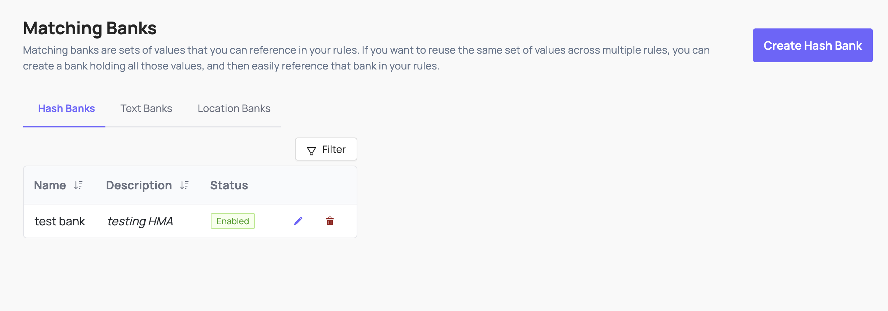

# Hasher-Matcher-Actioner (HMA)

Coop integrates with Meta's open-source [Hasher-Matcher-Actioner (HMA)](https://github.com/facebook/ThreatExchange/tree/main/hasher-matcher-actioner) to provide perceptual hash matching for known CSAM, non-consensual intimate imagery (NCII), terrorist and violent extremist content (TVEC), and any custom hash banks you maintain.

Hash matching works by computing a perceptual fingerprint (PDQ for images, MD5 for video) of submitted media and checking it against databases of known harmful content. Unlike AI classifiers, a hash match against a verified database like NCMEC's is a strong, reliable signal; known content will match reliably even if it's been slightly modified.

## Requirements

1. **A running HMA instance** accessible from your Coop server

2. **API credentials for any third-party hash banks** you want to use; for example, NCMEC provides Hash Sharing API credentials, Tech Against Terrorism provides access to their hash bank.

3. **Your own hash banks** (optional), i.e. if you have your own collection of known violations.

4. HMA service URL configured in Coop under **Settings** → **Integrations**.

Once connected, HMA signals will be available in Coop's signal library for use in routing rules and proactive rules.

## Managing Hash Banks

Hash banks are collections of known-harmful media fingerprints that you can reference in your rules. You can create and manage banks through the Coop UI, or sync them from external sources like NCMEC.

### Creating banks through Coop

The recommended approach is to create banks through **Settings** → **Matching Banks** in Coop. This registers the bank in both HMA and Coop's database automatically, making it immediately available in the rule builder.

Banks created through Coop are named in HMA using the convention `COOP_<ORGID>_<NORMALIZED_NAME>`, for example a bank named "Test Bank" for org `abcdef12345` becomes `COOP_ABCDEF12345_TEST_BANK` in HMA. This is what you will see in the HMA UI.

### Banks created directly in HMA

Banks created directly in HMA (via the HMA UI or seed scripts) will not appear in Coop's Matching Banks UI unless they are also registered in the `hash_banks` table. If you need to use an HMA-native bank in Coop rules, create a matching bank in the Coop UI first.

You can use the HMA UI to manually add content to any bank for local testing, regardless of how the bank was created.

## NCMEC Hash Sharing

For Coop to match against NCMEC's database of known CSAM hashes, you need credentials for NCMEC's [Hash Sharing API](https://report.cybertip.org/ws-hashsharing/v2/documentation/).

In HMA, create a bank sourced from the NCMEC exchange. HMA will begin syncing hashes on its background fetch schedule (every 5 minutes by default). The NCMEC-sourced bank will appear in Coop's **Matching Banks** once synced.

See the [NCMEC CyberTipline integration](ncmec.md) for details.

## Using HMA Signals in Rules

Once HMA is connected and hash banks are configured, the image hash signal is available in both routing rules and proactive rules.

- **To route content from [user reports](../api/report.md)**, create a [routing rule](../user/automated-enforcement.md#routing-rules) with the hash match logic and set it to route to the desired queue. For NCMEC matches, this should be your configured NCMEC queue.

  

- **For content submitted via the [items API](../api/items.md)**, if you want Coop to proactively hash and flag matches without a user report, create a [proactive rule](../user/automated-enforcement.md#proactive-rules) with the image hash condition and "Enqueue to NCMEC" action.

## See also

- [Automated Routing & Enforcement](../user/automated-enforcement.md) for more on building rules
- [NCMEC CyberTipline](ncmec.md) for details on configuring your NCMEC integration
