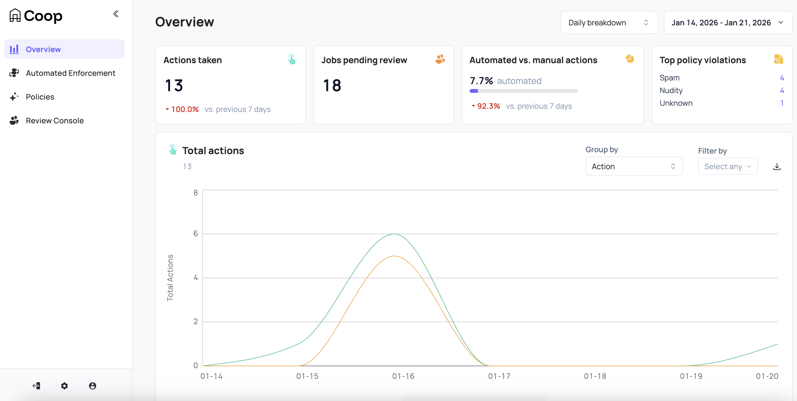

# Product Guide

Coop is a trust and safety review/moderation tool with a focus on both automation and human review. At a high level:

- Platform events are fed into Coop
- Events are either automatically actioned on or triaged into queues based on rules
- Human reviewers work the queues and perform actions based on platform policies
- Actions are reported back to the platform to be performed

This simplified diagram can help you better understand how data flows between a platform and Coop at a high level:
 

Coop's functionality can be broken down into several key areas:

- [Automated Routing & Enforcement](product/automation.md)
- [Manual Review & Enforcement](product/manual-review.md)
- [Investigation](product/investigation.md)
- [Bulk Actioning](product/bulk-actioning.md)
- [Appeals](product/appeals.md)
- [Metrics & Reporting](product/metrics.md)
- [Administration](product/administration.md)

<!--
To support this, the Coop dashboard is organized into the following sections:

1. Overview
2. Automated Enforcement
   1. Proactive Rules
   2. Matching Banks
3. Policies
4. Review Console
   1. Queues
   2. Routing
   3. Analytics
   4. Investigation
   5. Bulk Actioning
   6. Recent Decisions
   7. NCMEC Reports
5. Settings
   1. Item Types
   2. Actions
   3. API Keys
   4. Integrations
   5. Users
   6. Employee Safety
   7. Organization
   8. NCMEC Settings
-->
