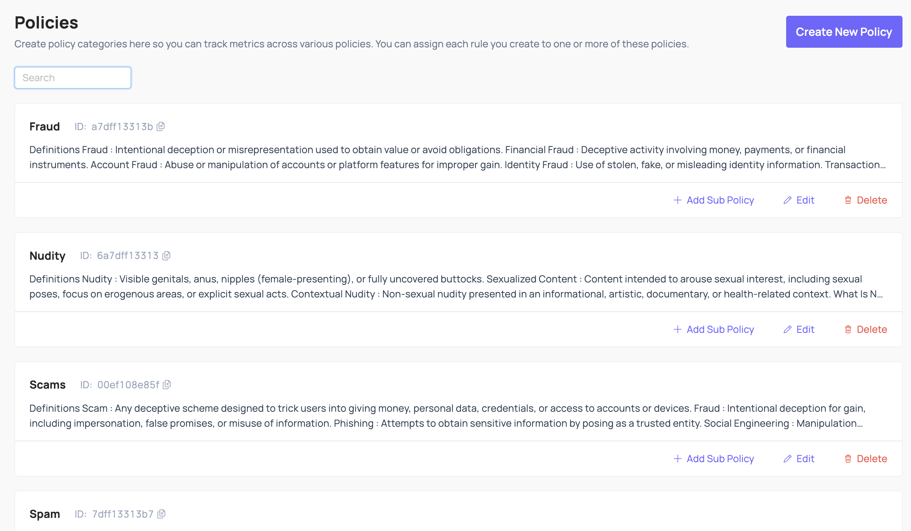
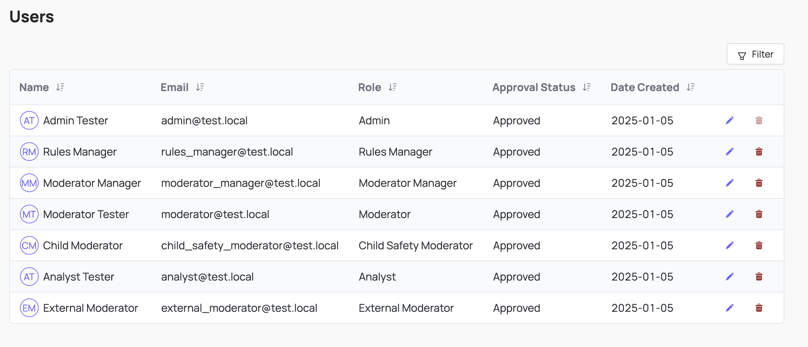
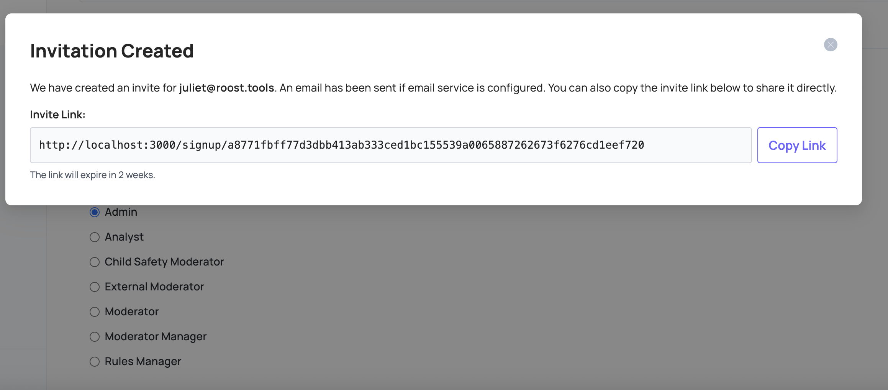

# Administration

Admins manage organization-wide configuration in Coop, including policies, user access, authentication, and integrations settings. All of these settings are accessible under **Settings** in the Coop UI.

## Policies



Policies are categories of harm that are prohibited or monitored on your platform. Some typical examples include Spam, Nudity, Fraud, Violence, etc. Policies can have sub-policies underneath them — for example, a Spam policy could have sub-policies like Commercial Spam, Repetitive Content, Fake Engagement, and Scams and Phishing.

It is often useful (and in some cases required by legislation such as the EU's Digital Services Act) to tie every action you take to one or more specific policies. For example, you could delete a comment under your Nudity policy, or under your Spam policy. Coop tracks those differences and measures how many actions you've taken per policy, so you can see how effectively you're enforcing each policy over time, identify gaps, and report to your team or to regulators.

Policies added in Coop's UI are visible to reviewers directly in the review flow.

Learn more about policies from the [Trust & Safety Professional Association](https://www.tspa.org/curriculum/ts-fundamentals/policy/policy-development/).

## User Management



Coop uses role-based access controls to ensure the right people can access the right data. You can invite users from **Settings → Users**, either copying the invite link to share directly or configuring an email service to send it automatically.



### Roles

Coop comes with seven predefined roles:

| User Role | Access Manual Review Tool | View all Queues | Create, Delete and Edit Queues | Create, Delete and Edit Rules | Access NCMEC data | Access Insights |
| :---- | :---- | :---- | :---- | :---- | :---- | :---- |
| Admin | Yes | Yes | Yes | Yes | Yes | Yes |
| Rules Manager | No | No | No | Yes | No | Yes |
| Moderator Manager | Yes | Yes | Yes | No | Yes | No |
| Child Safety Moderator | Yes | No | No | No | Yes | No |
| Moderator | Yes | No | No | No | No | No |
| Analyst | No | No | No | No | No | Yes |
| External Moderator | Yes | No | No | No | No | No |

**Admin**
Admins manage their entire organization. They have full control over all resources and settings within Coop.

**Rules Manager**
Rules Managers can create, edit, and deploy Live Rules, run retroaction and backtests, view rule insights, manage policies, use the Investigation tool, and bulk-action content. They cannot manage users, queues, or other organization-level settings.

**Moderator Manager**
Moderator Managers can view and edit all queues within the Manual Review Tool, manage moderator permissions, use the Investigation tool, and bulk-action content. They can also view child safety data.

**Child Safety Moderator**
Child Safety Moderators have the same permissions as Moderators, but can also review Child Safety jobs and see previous Child Safety decisions.

**Moderator**
Moderators can access the Manual Review Tool, but can only review jobs from queues they've been given permission to see. They cannot see any Child Safety-related jobs or decisions.

**Analyst**
Analysts can modify and test Draft and Background Rules, run backtests, and view rule insights and the Investigation tool. They cannot create or edit Live Rules, run Retroaction, or access the Manual Review Tool.

**External Moderator**
External Moderators can only review jobs in the Manual Review Tool. They cannot see any decisions or use any other tooling.

## SSO

Coop supports single sign-on via Okta SAML.

### Prerequisites

- Admin mode in Okta
- Group names that match exactly between Okta and SAML
- Admin permissions in Coop
- Ability to create a custom SAML application

### Configuration

1. Create a [custom SAML application](https://help.okta.com/oag/en-us/content/topics/access-gateway/add-app-saml-pass-thru-add-okta.htm) in Okta with the following settings:

   | Setting | Value |
   | :------ | :---- |
   | Single sign-on URL | Your organization's callback URL (e.g. `https://your-coop-instance.com/login/saml/12345/callback`). Find this in Coop under **Settings → SSO**. |
   | Audience URI (SP Entity ID) | Your Coop instance base URL (e.g. `https://your-coop-instance.com`). |
   | `email` attribute (in **Attribute Statements**) | `email`. This depends on your identity provider's attribute mappings (e.g. Google SSO may use "Primary Email"). |

2. In the **Feedback** tab, check **I'm a software vendor. I'd like to integrate my app with Okta**.
3. In your app's settings, go to the **Sign On** tab. Under **SAML Signing Certificates → SHA-2**, click **Actions → View IdP metadata**.
4. Copy the contents of the XML file. In Coop, go to **Settings → SSO** and paste the XML into the **Identity Provider Metadata** field.
5. On the same page, enter `email` in the **Attributes** section.
6. In your Okta app under **Assignments**, assign users or groups to your app.

## API Keys

Coop uses API keys to authenticate requests between your platform and Coop.

### Coop API key

To authenticate requests your platform sends to Coop, include your organization's API key as an HTTP header on every request. You can find or rotate your key in **Settings → API Keys**.

```
X-API-KEY: <<apiKey>>
Content-Type: application/json
```

### Webhook signature verification

To verify that incoming requests to your Action endpoints were sent by Coop, use the webhook signature verification key shown in **Settings → API Keys**. Coop signs each outgoing request using **RSASSA-PKCS1-v1_5** with SHA-256 and includes the signature in a `Coop-Signature` header.

To validate an incoming request:

1. Hash the raw request body using SHA-256.
2. Base64-decode the `Coop-Signature` header value to get the raw binary signature.
3. Verify the signature against the hash using your public key.

**Example (JavaScript / Node.js)**

```javascript
const pem = `-----BEGIN PUBLIC KEY-----
...your key...
-----END PUBLIC KEY-----`;

const pemHeader = "-----BEGIN PUBLIC KEY-----";
const pemFooter = "-----END PUBLIC KEY-----";
const publicKeyPem = pem.substring(pemHeader.length, pem.length - pemFooter.length);

const publicKeyBuffer = Buffer.from(publicKeyPem, "base64");
const requestBodyBuffer = Buffer.from(req.body, "utf8");
const signature = Buffer.from(req.headers["coop-signature"], "base64");

const publicKey = await crypto.subtle.importKey(
  "spki",
  publicKeyBuffer,
  { name: "RSASSA-PKCS1-v1_5", hash: { name: "SHA-256" } },
  false,
  ["verify"]
);

const isValid = await crypto.subtle.verify(
  "RSASSA-PKCS1-v1_5",
  publicKey,
  signature,
  requestBodyBuffer
);
```

Adjust the header name (`coop-signature` vs `Coop-Signature`) and body encoding to match how your server receives the request.
