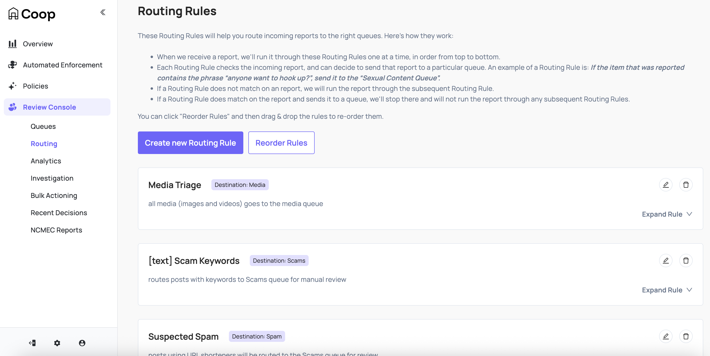
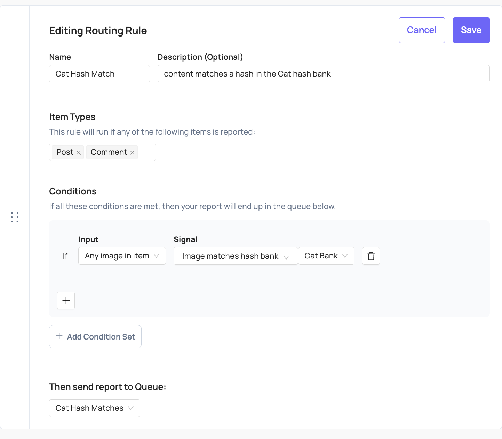
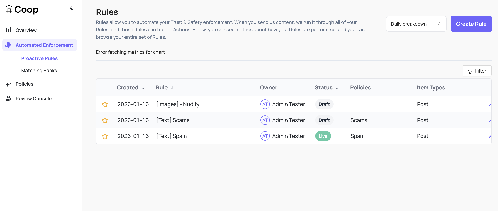
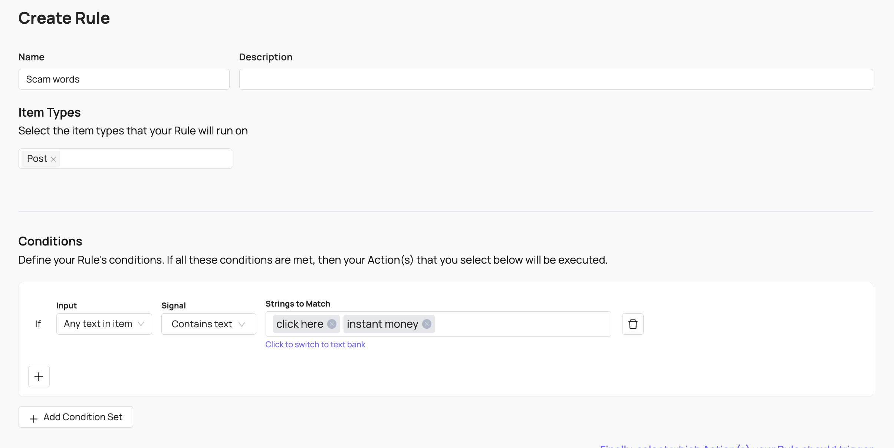
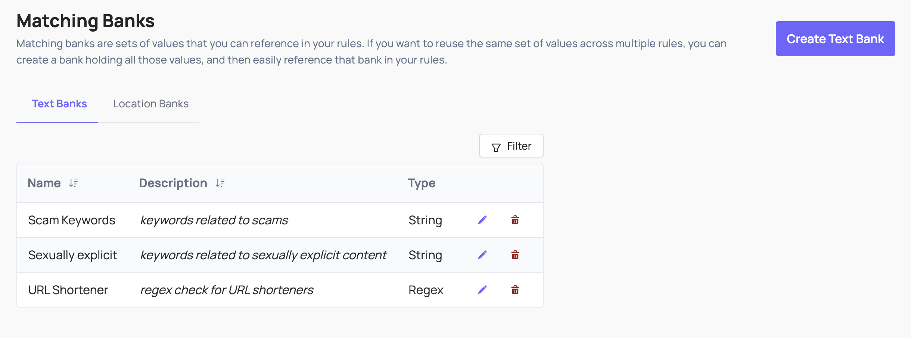
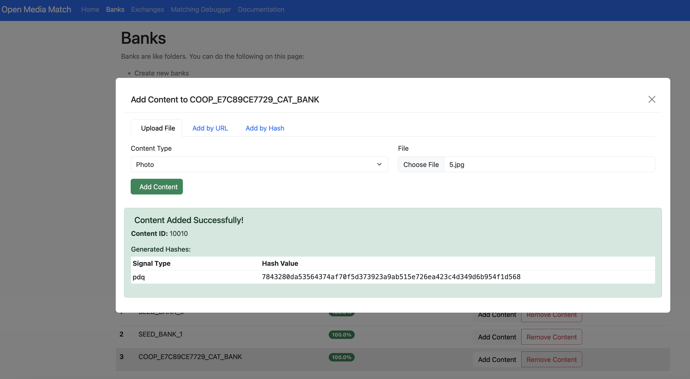
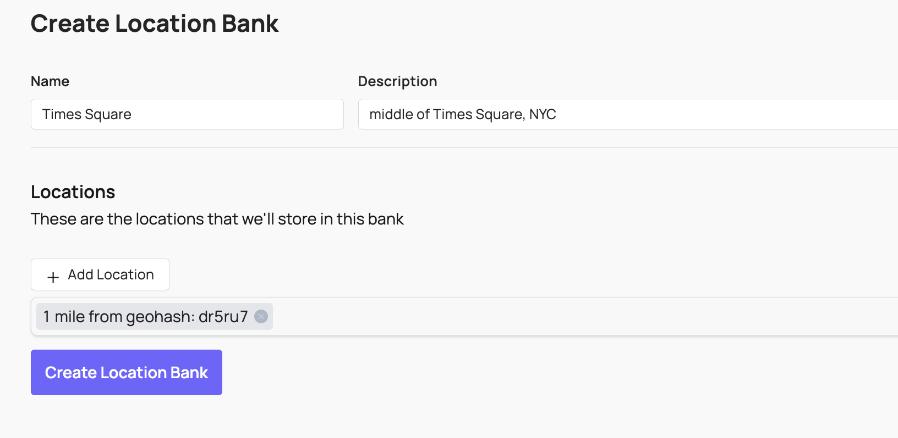

# Automated Routing & Enforcement

Coop enables you automate both routing tasks to queues with [Routing Rules](#routing-rules) and performing actions with [Proactive Rules](#proactive-rules). 

Both types of rules are created from common building blocks, including [Matching Banks](#matching-banks) and [Signals](#signals). Rules are configured to run only on the specified item types that are configured for your platform; for example, you might have text-based rules for posts and comments, and hash-matching rules for avatars and embedded images.

## Routing Rules

Routing Rules help direct matching reports to the correct manual review queue. The rules are executed in order, with reports routed according to the first match. Configure Routing Rules in Coop under **Review Console** → **Routing**.

Each Routing Rule contains one or more conditions; when all conditions are met, the report will be routed to the selected queue.

## Proactive Rules

Proactive Rules enable Coop to perform automated enforcement. Content sent to Coop is checked against all Proactive Rules, performing configured actions according to each matching rule. Configure Proactive Rules in Coop under **Automated Enforcement** → **Proactive Rules**.

Each Proactive Rule contains one or more conditions; when all conditions are met, the selected action will be performed.

## Matching Banks

Matching banks are sets of values that you can reference in your rules, including text, locations, and hashes.

### Text Banks

### Hash Banks

### Location Banks

## Signals

- Integrations
