# User Guide

Protect your users from harm with remarkable ease.

[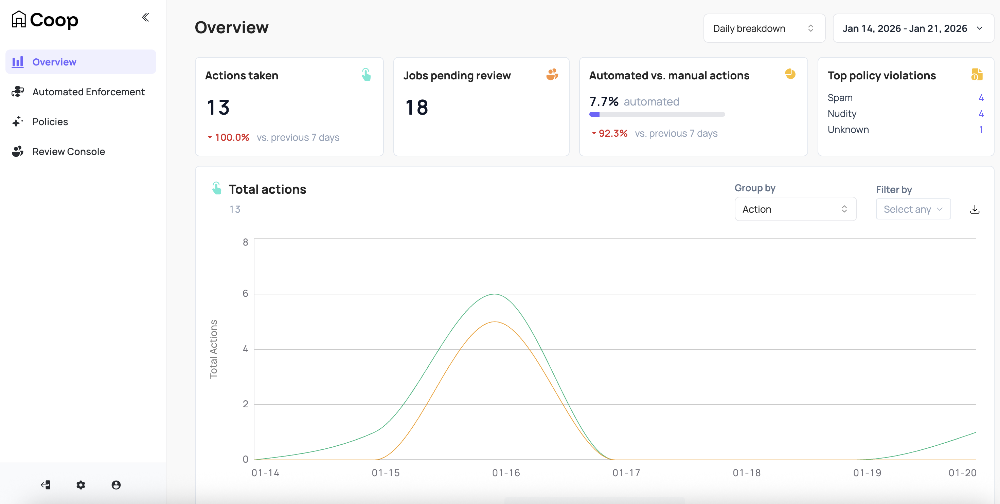](../images/overview.png)

Coop is the open source review and moderation tool from [ROOST](https://roost.tools) that provides a comprehensive solution for online safety:

- **[Automated Enforcement](automated-enforcement.md)**: Customizable multi-condition rules that evaluate every submitted item against signals to automatically take action or route reports to a human review queue based on your policies

  | [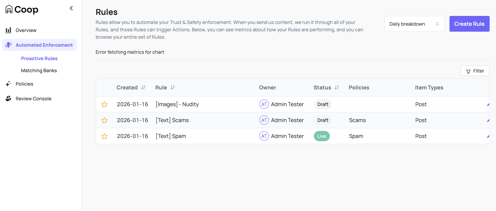](../images/rules.png)          | [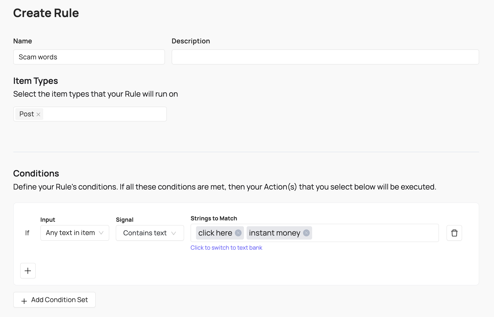](../images/scam-rule.png)               |
  | ------------------------------------------------------------- | ------------------------------------------------------------------------------ |
  | [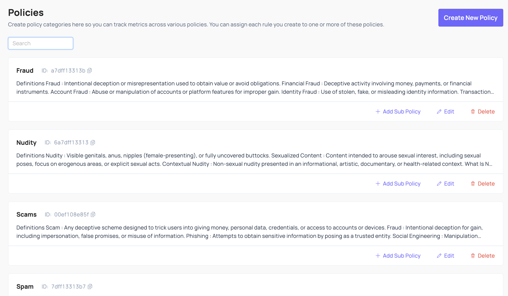](../images/policies.png) | [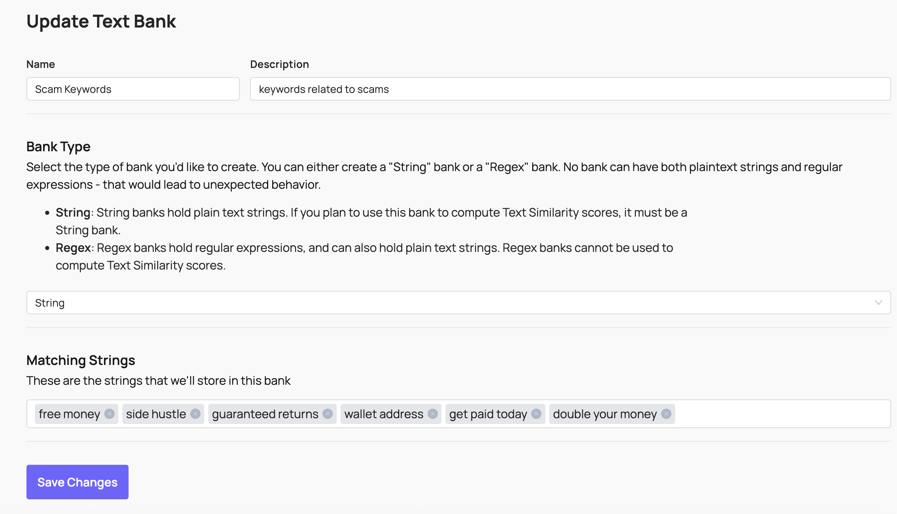](../images/text-string-bank.png) |

- **[Review Console](review-console.md)**: Configurable human review queues for moderators to quickly make complex policy-based moderation decisions, with added context and wellness features built-in

  | [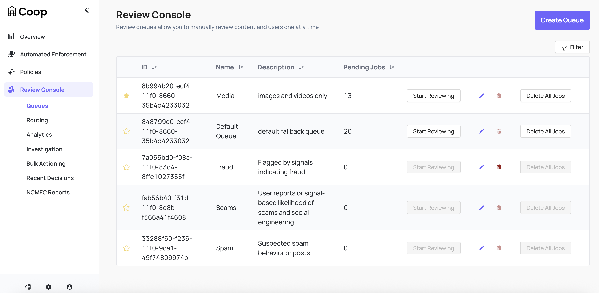](../images/review-console.png)                            | [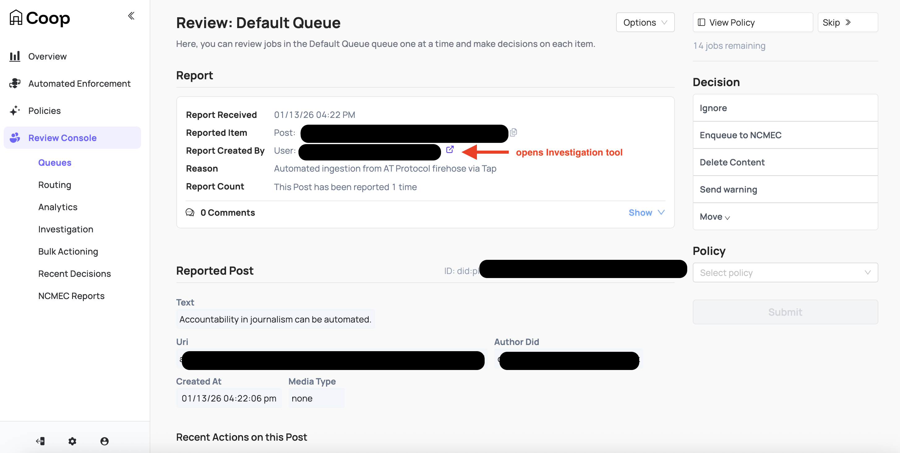](../images/job-page.png)                                    |
  | ---------------------------------------------------------------------------------------------------------- | ------------------------------------------------------------------------------------------------ |
  | [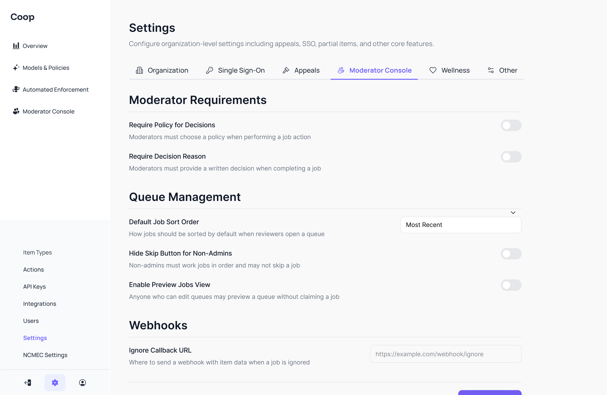](../images/settings-review-console.png) |  |

- **[Integrations](../integrations/) & [Rich Content Processing](signals.md)**: Support for reviewing and matching against text content and threads, images and video media, account data, and custom content types using built-in signals plus free safety APIs from Google, OpenAI, Zentropi, and NCMEC out of the box

  | [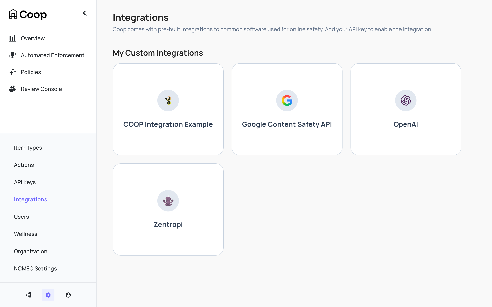](../images/integrations.png) | [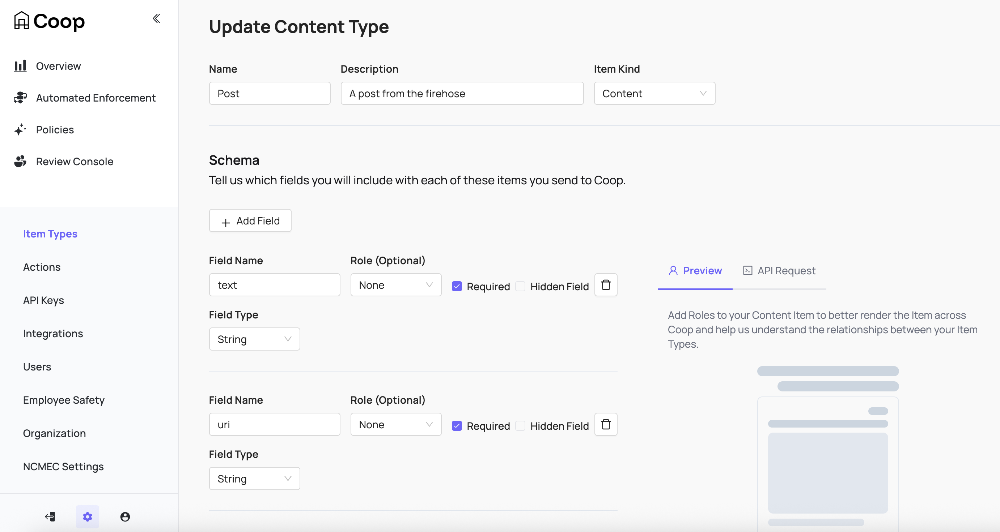](../images/items.png)                             |
  | ------------------------------------------------------------------------- | -------------------------------------------------------------------------------- |
  | [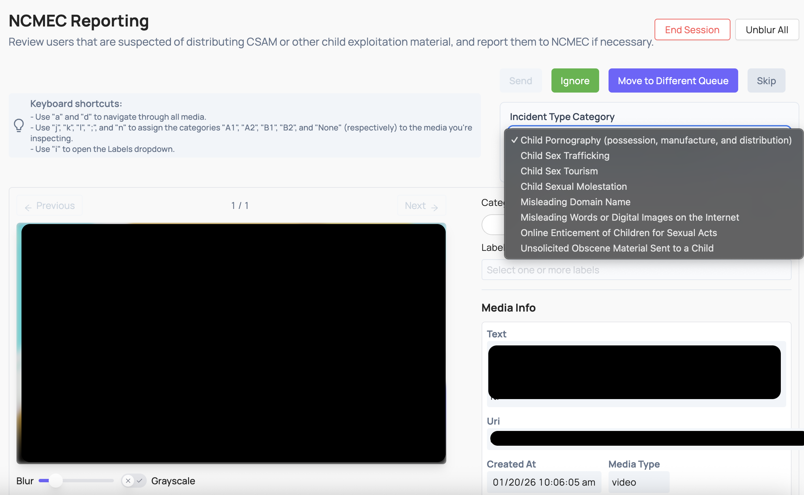](../images/ncmec-job.png)          |  |

- **[Metrics & Reporting](metrics.md)**: Dashboards and detailed audit logs for accountability and insights into moderation effectiveness and trends

  | [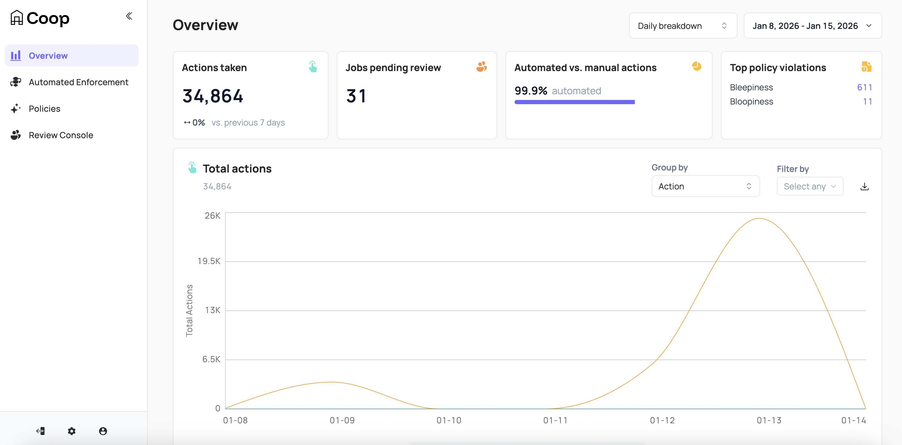](../images/dashboard.png) | [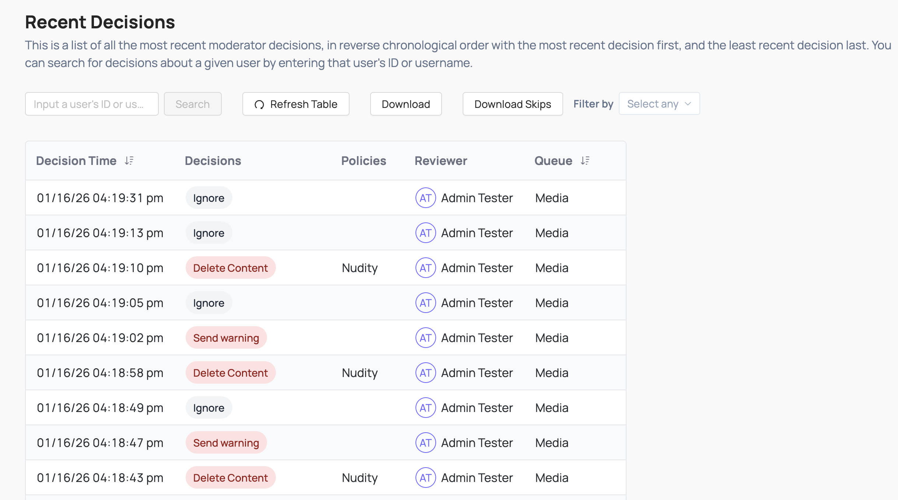](../images/recent-decisions.png) |
  | ---------------------------------------------------------------- | ------------------------------------------------------------------------------------- |

- **[API Integration](../api/)**: Simple REST and webhook APIs power seamless bidirectional platform integration for content ingestion, user reports, appeals, performing moderation actions, fetching additional items, and more

  | [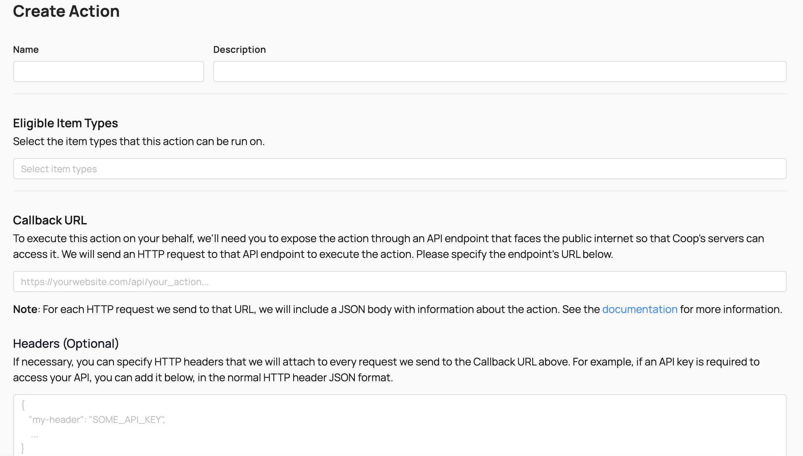](../images/define-action.png) | [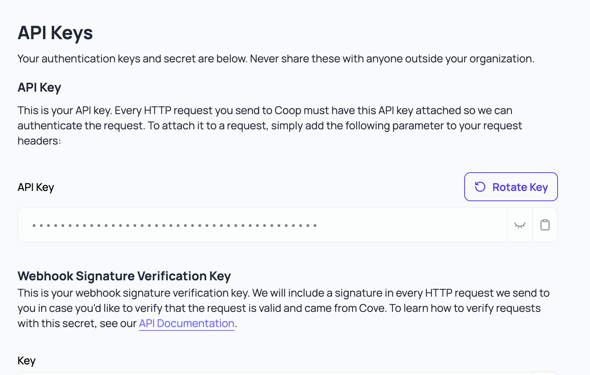](../images/api-keys.png) |
  | --------------------------------------------------------------------- | ------------------------------------------------------------- |

- **So much more.** Coop supports NCMEC reporting, hash matching, appeals, investigation, bulk actioning, powerful user/role management, location-based enforcement, and single sign-on to name a few. And as an open source project with custom integration support, the potential for adaptability is limitless.

## How Coop works

This simplified diagram can help you better understand how data flows between a platform and Coop:

For more detail, review the [basic concepts](concepts.md), [technical architecture](../development/architecture.md), and [API reference](../api/).

## Getting started as an admin

We recommend beginning by familiarizing yourself with Coop's [basic concepts](concepts.md). Once you're up to speed:

1. Ensure you have an account and API key for your Coop instance

2. Define your [Item Types](administration.md#item-types); the kinds of content and actors on your platform

3. Input your detailed platform [Policies](administration.html#policies)

4. Define your [Actions](administration.md#actions) and expose [callback endpoints](../api/actions.md) so Coop can trigger enforcement on your platform

Once Coop is configured, your platform can:

1. Begin submitting items to Coop via the [Items API](../api/items.md) so they run through your proactive rules

2. Submit user reports via the [Report API](../api/report.md) to route them into review queues for your moderators

