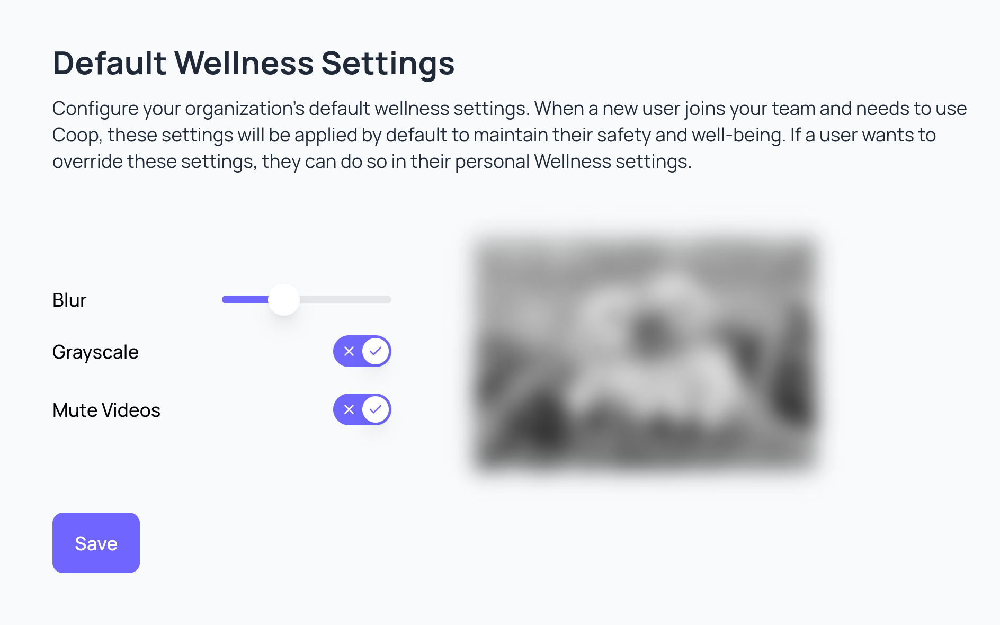

# User Guide

Coop enables you to protect your users from harm with remarkable ease.

|  |  |
| ----------------------------------- | ----------------------------------------------- |
|  |          |
|  |      |

Coop is a trust and safety platform built around two functional areas that can be used independently or together:

- **Automated Enforcement**: rules that evaluate every submitted item and automatically take action or route it to a review queue

- **Review Console**: a human review queue where moderators examine flagged content and make enforcement decisions

This simplified diagram can help you better understand how data flows between a platform and Coop:

## Getting started as an admin

We recommend beginning by familiarizing yourself with Coop's [basic concepts](concepts.md). Once you're up to speed:

1. Ensure you have an account and API key for your Coop instance

2. Define your [Item Types](administration.md#item-types); the kinds of content and actors on your platform

3. Input your detailed platform [Policies](administration.html#policies)

4. Define your [Actions](administration.md#actions) and expose [callback endpoints](../api/actions.md) so Coop can trigger enforcement on your platform

Once Coop is configured, your platform can:

1. Begin submitting items to Coop via the [Items API](../api/items.md) so they run through your proactive rules

2. Submit user reports via the [Report API](../api/report.md) to route them into review queues for your moderators

