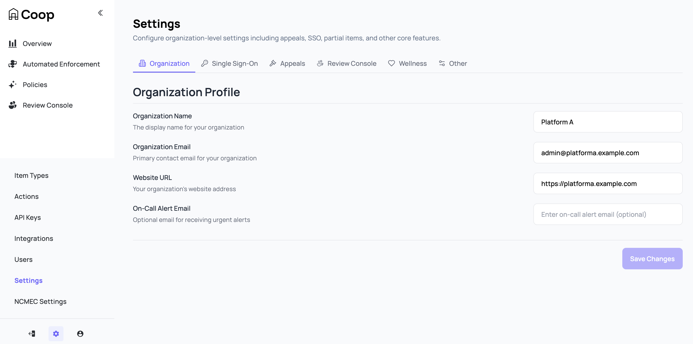
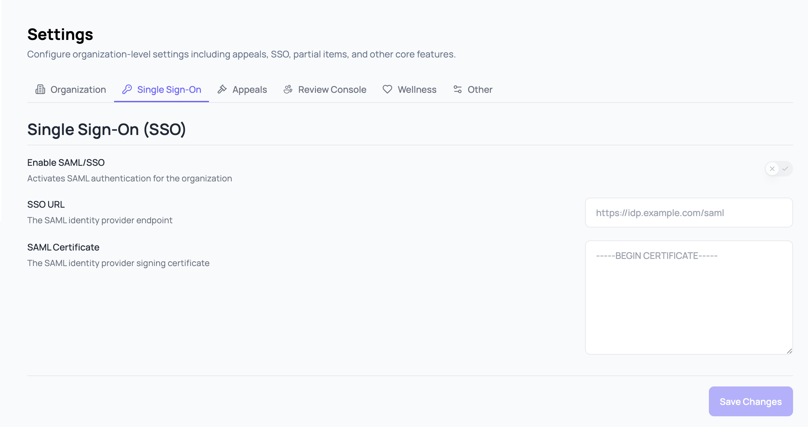
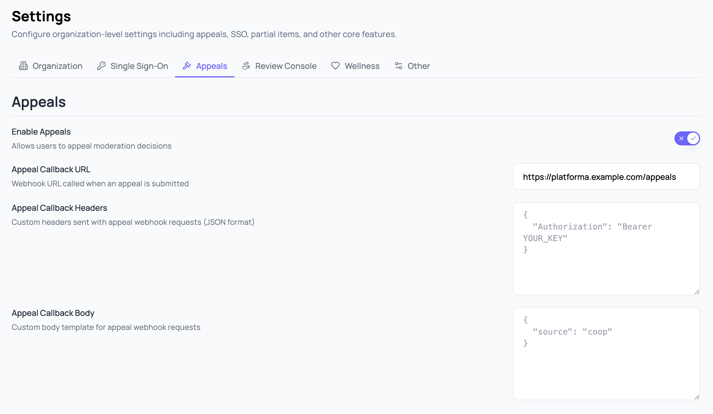
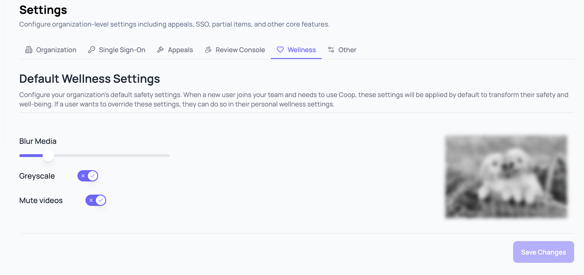
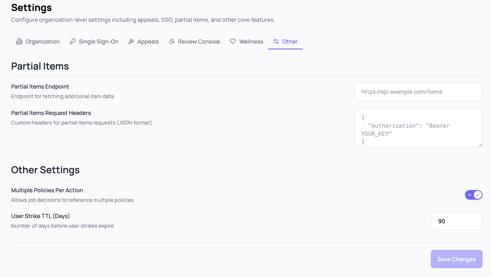
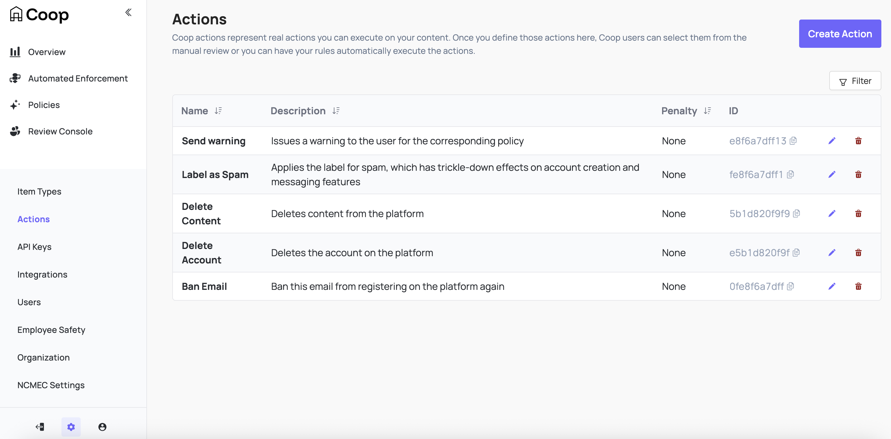
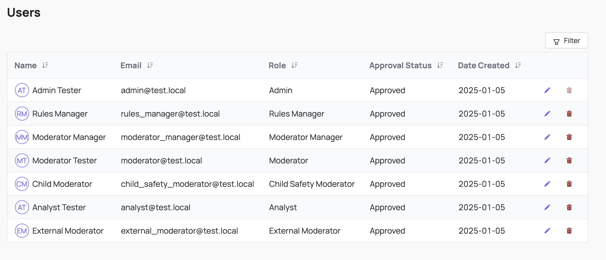
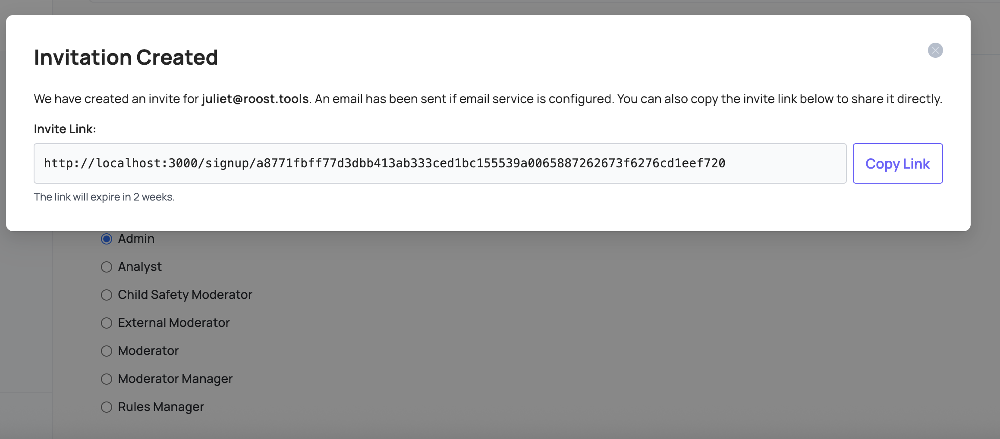
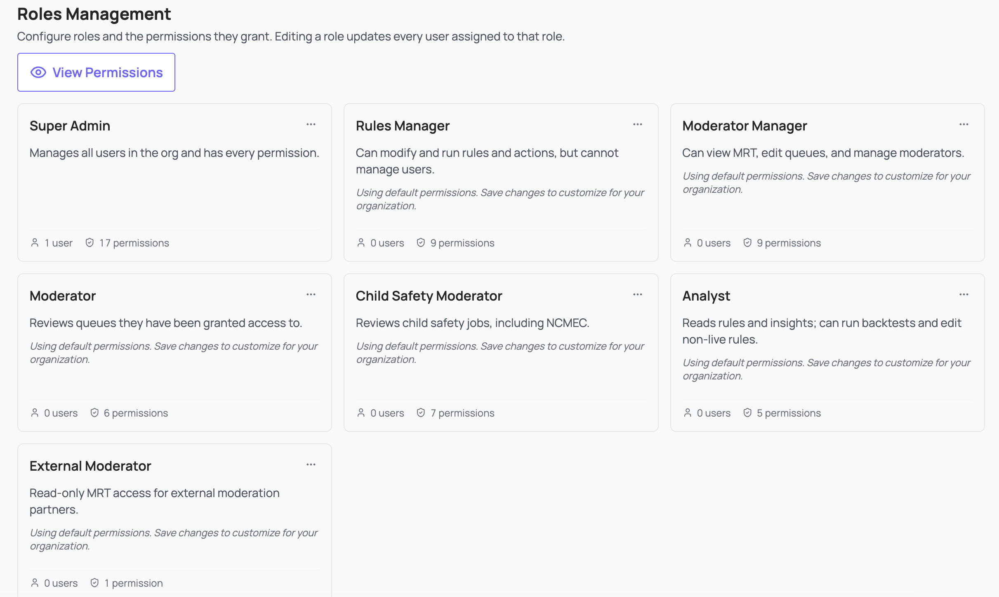

# Administration & Settings

Admins manage the organization's configuration including settings as well as specific configuration for [items](#item-types), [actions](#actions), [policies](#policies), [user access](#user-management), and integrations from the **Settings** menu.

## Settings

Configure the organization profile and org-wide behavior including single sign-on, appeals, review console, wellness, and more under **Settings**. Many of the toggleable features are off by default, so opt in to the ones applicable to your platform and team.

### Organization

Identity and contact information for your Coop organization.



The On-Call Alert Email requires an email service to be integrated with your Coop deployment. Coop supports email service integration but does not ship with one configured.

### Single Sign-on

Enable SAML-based SSO so users authenticate through your identity provider instead of email and password. Coop supports any SAML 2.0 identity provider. See [single sign-on](../development/deployment.md#single-sign-on) in the deployment guide for an example of setup using Okta.



### Appeals

Enable user user appeals of decisions made in Coop, and configure your platform's appeals callback URL, headers, and body.



### Review Console

Behavior of the [Review Console](review-console.md) for reviewers in your org. Configure moderator requirements, queue management behavior, and webhooks.


### Wellness

Reviewer wellness controls for media displayed in the Review Console including blur, grayscale, and mute. These help reduce exposure to harmful media during review.



### Other

Settings that don't fit cleanly into the other tabs including configuration for the [Partial Items](../api/partial-items.md) endpoint and the ability for job decisions to reference multiple policies.



## Item Types

Item Types represent the different types of entities on your platform. See [Concepts → Item Type](concepts.md#item-type) for details.


When creating an Item Type, define the schema to include which fields will be included and shown to reviewers. These fields are also available in any rule logic to connect with signals for routing or automation.

## Actions

Actions represent anything that can be performed on Items by proactive rules or moderator decisions. See [Concepts → Actions](concepts.md#actions) for details.



Actions are paired with API enpoints on your platform. See [Handling Actions](../api/actions.md) for technical details.


## Policies

Policies are the set of rules and guidelines that a platform uses to govern the conduct of its users. See [Concepts → Policy](concepts.md#policy) for details.


Policies added in Coop's UI are visible to reviewers directly in the [Job view](review-console.md#job-view) of the Review Console.

## User management

Coop uses role-based access controls to ensure the right people can access the right data.



You can invite users from **Settings** → **Users**, either copying the invite link to share directly or configuring an email service to send it automatically.



### Roles

Coop ships with seven default roles that cover most team structures out of the box:

- **Admin**: manages the entire organization. They have full control over all resources and settings within Coop.

- **Rules Manager**: can create, edit, and deploy Live Rules, run retroaction and backtests, view rule insights, manage policies, use the Investigation tool, and bulk-action content. They cannot manage users, queues, or other organization-level settings.

- **Moderator Manager**: can view and edit all queues within the Review Console, manage moderator permissions, use the Investigation tool, and bulk-action content. They can also view child safety data.

- **Child Safety Moderator**: the same permissions as Moderators, but can also review Child Safety jobs and see previous Child Safety decisions.

- **Moderator**: can access the Review Console, but can only review jobs from queues they've been given permission to see. They cannot see any Child Safety-related jobs or decisions.

- **Analyst**: can modify and test Draft and Background Rules, run backtests, and view rule insights and the Investigation tool. They cannot create or edit Live Rules, run Retroaction, or access the Review Console.

- **External Moderator**: can only review jobs in the Review Console. They cannot see any decisions or use any other tooling.

Admins can customize any role under **Settings** → **Users** → **Roles**. Open the menu on any role card to edit its display name, description, and permissions; individual permissions are grouped by area (organization management, rules, manual review, and investigation) and can be toggled on or off. **View Permissions** opens a matrix comparing all roles at a glance.



Changes apply immediately to every user assigned that role. Access to the role editor requires the **Manage Roles** permission, which Admins have by default.

## API Keys

Coop uses API keys to authenticate requests between your platform and Coop.

### Coop API key

To authenticate requests your platform sends to Coop, include your organization's API key as an HTTP header on every request. You can find or rotate your key in **Settings** → **API Keys**.

```
X-API-KEY: <<apiKey>>
Content-Type: application/json
```

To verify that incoming requests to your Action endpoints were sent by Coop, use the webhook signature verification key shown in **Settings** → **API Keys**. See [API Keys and Authentication](../development/api-auth.md) in the Development Guide for implementation details.
