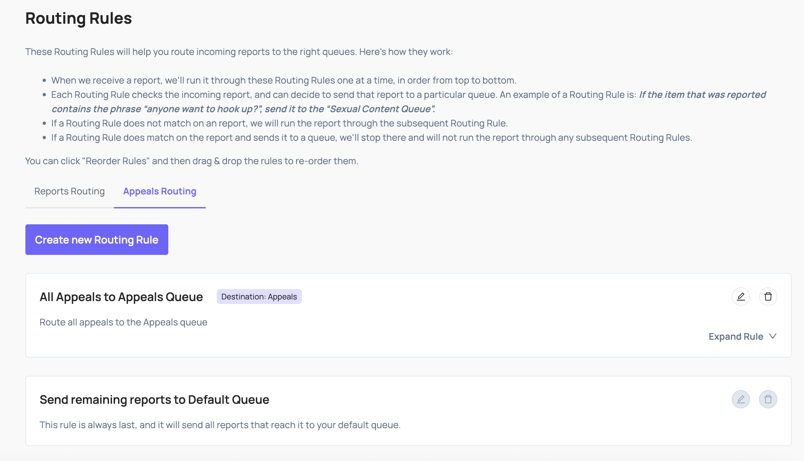

# Appeals

When a user on your platform is unsatisfied with a moderation decision and submits an appeal, asking you to re-review it, you can send that appeal request to Coop through the Appeal API. Coop routes it to a review queue, where a moderator can examine the original decision and choose to uphold or overturn it.

## How appeals appear in Coop

To populate appeals in your review queues, send Coop appealed decisions and create a routing rule targeting them.

Appeals arrive in the Review Console as jobs, similar to reports. The job shows the item that was originally actioned, the policies cited, the user's appeal reason, and any additional context you included when submitting the appeal.

## Upholding or overturning an appeal

Reviewers see the original moderation decision and can choose to:

- **Uphold**: the original action was correct; the appeal is rejected
- **Overturn**: the original action was incorrect; the appeal is accepted

Once a decision is made, Coop sends the outcome back to your platform via the Appeal Decision Callback, so you can communicate the result to the user.

## Implementation

Before implementing the Appeal API, complete your [Basic Concepts](concepts.md) setup: you'll need [Item Types](concepts.md#item-type), [Actions](concepts.md#actions), and [Policies](concepts.md#policy) configured in Coop first.

See the [Appeal API](../api/appeal.md) reference for the full request schema and authentication requirements, and [Handle Moderation Actions](../api/actions.md#appeal-decision-callback) for the Appeal Decision Callback.
