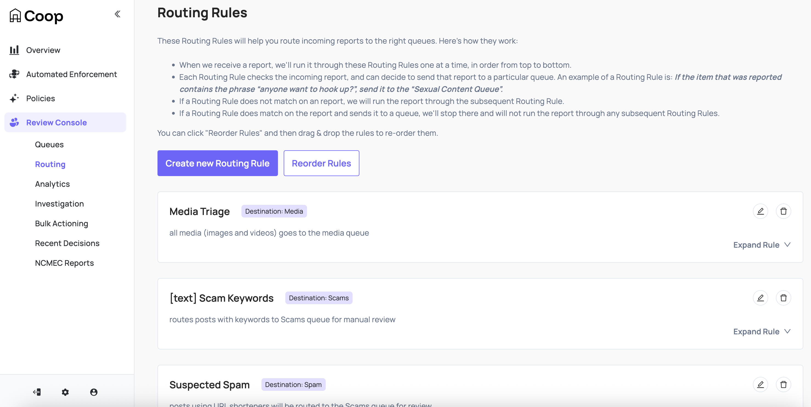
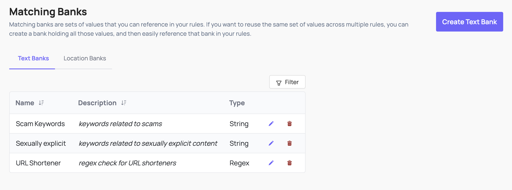
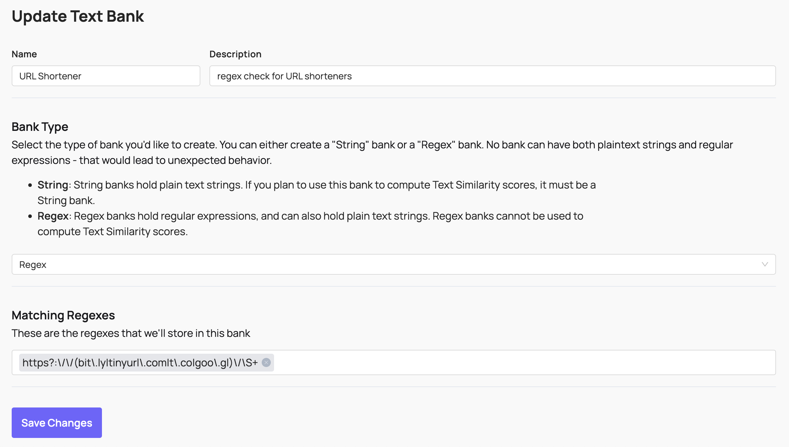
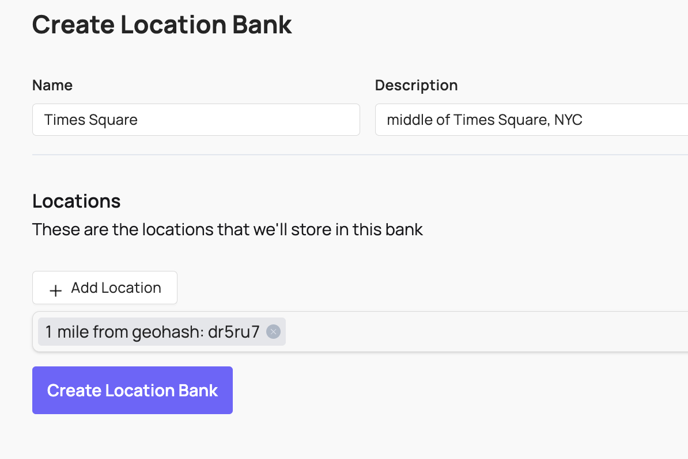
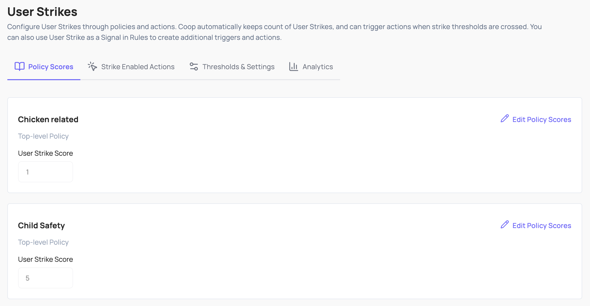
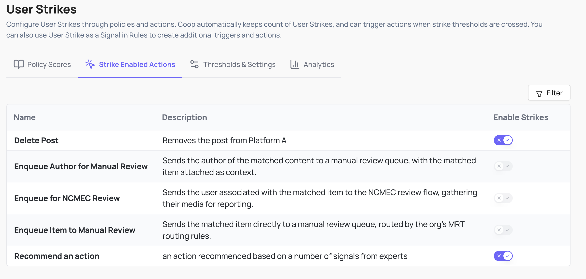
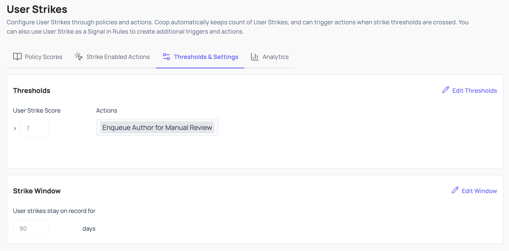
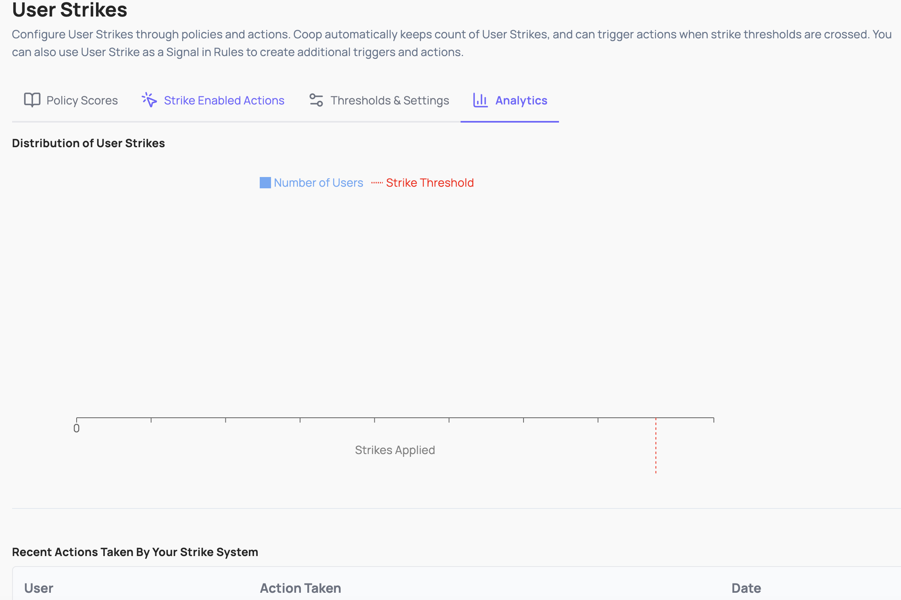

# Automated Routing & Enforcement

Coop supports automatically performing actions on submitted items with [Proactive Rules](#proactive-rules), and routing reports to the correct review queue with [Routing Rules](#routing-rules).

## Rules

Both types of rules are built from the same building blocks: conditions that reference [Signals](signals.md) and [Matching Banks](#matching-banks). Each rule is scoped to one or more item types, so you can have text-based rules for posts and comments, hash-matching rules for images and videos, or location-based rules for user-submitted content with geographic metadata.

Rule conditions can be set to **AND** (all must match for the rule to match) or **OR** (the rule matches when any condition matches).

### Proactive Rules

Proactive Rules automate enforcement. When an item is submitted to Coop, every active Proactive Rule is evaluated against it, and any matching rule's configured action is executed automatically. Configure them under **Automated Enforcement → Proactive Rules**.

All Proactive Rules that match an item fire, not just the first one. This means a single piece of content can trigger multiple automated actions if more than one rule matches.

The action of a Proactive Rule can be set to _Enqueue Item to Manual Review_ which will convert it to a report that will then be matched against Routing Rules in order to send it to the correct queue.

### Routing Rules

Routing Rules direct incoming reports to the correct Review Console queue. Configure them in Coop under **Review Console → Routing**.

Rules are evaluated in order, and a report is routed to the queue of the first matching rule. If no rule matches, the report goes to the default queue. Each rule contains one or more conditions.

## Matching Banks

Matching banks are reusable sets of values you can reference across many rules without repeating yourself. Instead of listing all banned keywords in every rule that needs them, you define a bank once and reference it wherever needed.

### Text Banks

Text banks hold lists of exact words or phrases, or regular expressions. Use them for keyword matching and pattern detection in text fields.

Coop also supports variant matching to catch evasion attempts, for example treating `h3||0` and `helllllllloooo` as matches for `hello`. See [Signals → Text analysis](signals.md#text-analysis) for details on text signal types.

### Hash Banks

Hash banks hold perceptual fingerprints of known harmful media. Coop uses these in conjunction with HMA to match images and videos against databases of known CSAM, NCII, TVEC, and any custom content you fingerprint. See [Hasher-Matcher-Actioner (HMA)](../integrations/hma.md) for setup.

### Location Banks

Location banks hold lists of [geohashes](https://en.wikipedia.org/wiki/Geohash) or Google Maps Places references. Use them to apply different rules to specific geographic areas, for example stricter content policies on college campuses, or targeted enforcement in particular regions.

For location matching to work, include a geohash in every item you send to Coop representing the location of the user who created the content.

## User Strikes

User Strikes track repeated policy violations against individual users on your platform, so escalating responses can be applied automatically. Configure them through policies and actions: Coop keeps count of strikes, and triggers further actions when configured thresholds are crossed.

Configure User Strikes under **Automated Enforcement → User Strikes**. The dashboard has four tabs.

### Policy Scores

Each policy can contribute a different weight to a user's strike score. A serious policy violation might add 3 to the score, while a minor one might add 1. The strike score is the running total across all violations within the configured strike window.

Sub-policies can either inherit their parent policy's weight or override it. Use the **Apply to sub-policies** toggle to set inheritance.

### Strike Enabled Actions

The Strike Enabled Actions tab lists every action your org has defined and lets you toggle which ones add to a user's strike score when applied. Not every action should count as a strike: for example a "send warning" action might not, while "remove content" or "ban account" should.

Toggle the **Strike Enabled** column on for any action that should increment the score. Strike score is computed using the policy weights from the previous tab combined with the action that was taken.

### Thresholds & Settings

Define how long strikes stay on record and what happens when a user's strike score crosses a threshold.

**Strike Window** controls how long a strike stays on a user's record. Strikes older than the window are excluded from the running score. The same value is editable from [Settings → Other → User Strike TTL](settings.md#other).

**Thresholds** are score values that, when crossed, trigger an action automatically. Configure as many as you want. For example:

- Score 5: enqueue the user for manual review
- Score 10: temporarily restrict posting
- Score 20: ban the account

Actions in the dropdown come from your org's [defined actions](administration.md#actions).

### Analytics

A distribution chart of strike scores across users in your organization. Helps you tune thresholds before turning them on: if most active users sit at score 0 to 2 and a small tail is at 8 or above, a threshold at 8 will catch the worst offenders without trapping average users.

## Signals

Signals are what rule conditions actually evaluate. A signal takes an item field and returns a score, which the rule condition compares against a threshold. See [Signals](signals.md) for more information.
