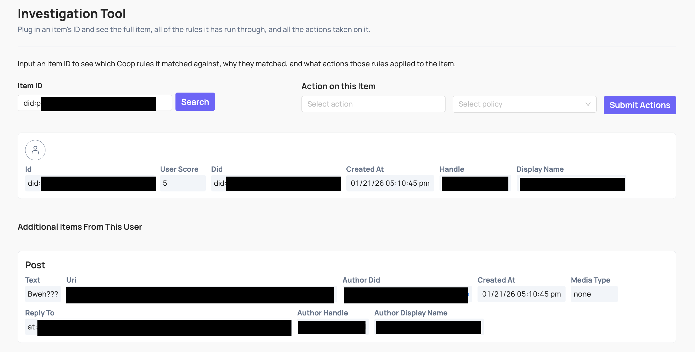

# Investigation

The Investigation tool lets you look up any item or user in Coop by their unique ID and see everything Coop knows about them, without needing to be in a review queue.

Enter the unique ID of an item or user to see:

- The item itself, including all fields and metadata Coop has on it
- The user who created the item (if applicable), and all their associated metadata
- The full history of actions taken on the item and its creator, including who made each decision
- Related items: for example, surrounding comments in the same thread for context

You can also navigate to Investigation directly from a job in the Review Console by clicking through from the item or user in the job view.

## Taking action

You can take action on an item directly from Investigation without being in a review queue. Use the **Take action on this item** form: select an action, choose a policy if required, and click **Submit Actions**.

This is useful for acting on content outside of a normal review flow, for example when investigating a user after receiving a report through another channel, or taking a follow-up action after an earlier decision.

## Reversing an action

Coop has no built-in undo. To reverse an action (like unbanning a user), you need a custom action in Settings that calls your platform's reverse endpoint, for example an "Unban user" action that calls your platform's unban API.

Once that action is configured, run it from Investigation or navigate to the item via the Recent Decisions log. Taking the action sends the callback to your platform to carry out the reversal.
