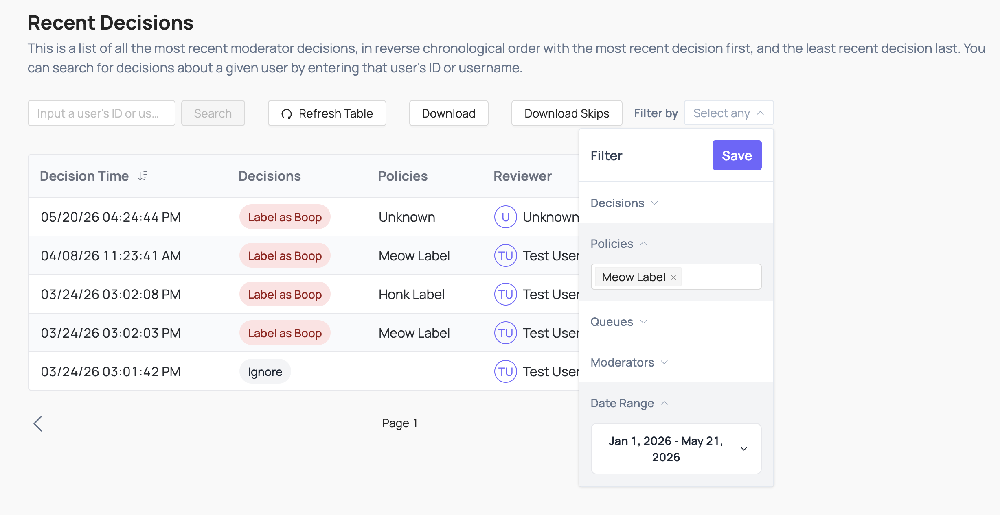

# Metrics & Reporting

Coop tracks moderation activity across two surfaces: the Overview dashboard for operational metrics, and the Recent Decisions log for a full audit trail.

## Overview

The Overview dashboard gives a high-level picture of moderation activity. All metrics can be filtered by an hourly or daily breakdown across a configurable time window. The overview displays:

- **Total actions taken**: Count of all moderation decisions in the selected window

- **Jobs pending review**: How many jobs are currently sitting in queues waiting for a moderator

- **Automated vs. manual actions**: Percentage breakdown of decisions made by proactive rules vs. human reviewers

- **Top policy violations**: Which policies account for the most actions taken

- **Decisions per moderator**: How work is distributed across your review team

- **Actions per rule**: Which rules are firing most frequently (only shown when rules are enabled)

- **Violations by policy**: Count of actions taken under each policy over time

## Recent Decisions

Visit **Review Console** → **Recent Decisions** to review every action taken in Coop: who made the decision, on what content, and when. You can click through to the full job from any entry to investigate further or take an additional action.

The log can be downloaded in its entirety, or filtered according to decisions, policies, queues, moderators and date ranges and then downloaded. This makes it particularly useful for:

- **Transparency reporting**: export decisions to include in reports to regulators or oversight bodies

- **QA and auditing**: sample decisions made by individual moderators or by automated rules to check for consistency and accuracy

- **Overturn workflows**: navigate from a logged decision back to the original job to reverse it if needed

You can also download a separate export of only the jobs that were _skipped_ by moderators, which can help identify content that may be systematically difficult to adjudicate.
