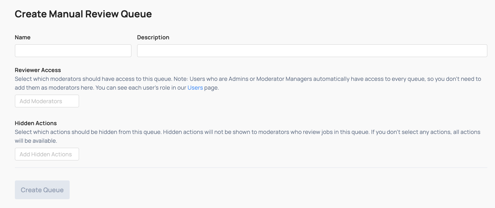

# Manual Review & Enforcement

The **Review Console** is where moderators work through reported content.

## Queues

Coop uses queues to organize review jobs. When content is reported (whether by a user on your platform or a [proactive rule](automated-enforcement.md#proactive-rules)), it enters a queue until it is reviewed and a decision is made.

A moderator selects **Start Reviewing** on any queue to begin working through it. Coop pulls the oldest job first, and after you make a decision, the next one loads automatically until the queue is empty or you stop.

Two moderators will never receive the same job, preventing duplicate work.

Queues can be starred per-user to pin them to the top of the Review Console. Each queue shows a count of pending jobs so you can prioritize accordingly.

### Creating and editing queues

Moderator managers and admins can create and edit queues for your organization.

When creating or editing a queue, you can configure **Reviewer Access** to determine which moderators can access and work jobs in that queue. **Hidden Actions** determines which actions are not available to moderators in this queue; this is useful for restricting what decisions reviewers can make in a given context, e.g. hiding permanent bans in a first-pass triage queue.

[Routing Rules](automated-enforcement.md#routing-rules) determine which incoming jobs are directed to which queue.

## Job view

Each **job** in a queue displays the report and everything Coop knows about the flagged content or user being reviewed. Each job has its own URL and can be shared with anyone at your organization who has access to Coop.

At minimum, the item's configured fields are rendered. Depending on the item type (post, comment, profile, direct message, etc.), Coop also surfaces additional context:

- The user account associated with the content
- Other content from the same user

### Decisions

Each job shows the decisions available to the reviewer. By default, every queue includes:

- **Ignore**: close the job with no action taken
- **Enqueue to NCMEC**: move the job to the NCMEC review queue, converting it to a user-level review that aggregates all media associated with the user
- **Move**: transfer the job to a different queue
- **[Custom actions](administration.md#actions)** you have configured for the relevant item type, besides those hidden for the current queue

Policies are visible to reviewers directly in the job view so they can reference enforcement guidelines without leaving the review flow.

### Comments

Moderators can add internal comments to any job to communicate with teammates—flagging a concern, requesting a second opinion, or documenting context for future reference. Comments are visible only to members of your organization and are never shown to the reported user or the reporter.

## Wellness

Reviewer wellness and safety is a core concern in trust & safety work. Coop includes configurable settings to reduce the impact of reviewing harmful content. Coop supports:

- **Blur**: Images and videos are blurred by default. Hover over an image to temporarily unblur it; move the cursor away to blur it again. Playing a video unblurs it. You can set the blur strength or disable blurring entirely.

- **Grayscale**: Display media in grayscale instead of full color. Can reduce the emotional impact of graphic content.

- **Mute Videos**: Mute all videos by default, regardless of device volume.

### Organization-wide defaults

Admins can set default wellness settings that apply to all users in the organization under **Settings → Wellness**.

Any user can override the organization defaults with their own preferences under **Account → Wellness**.
