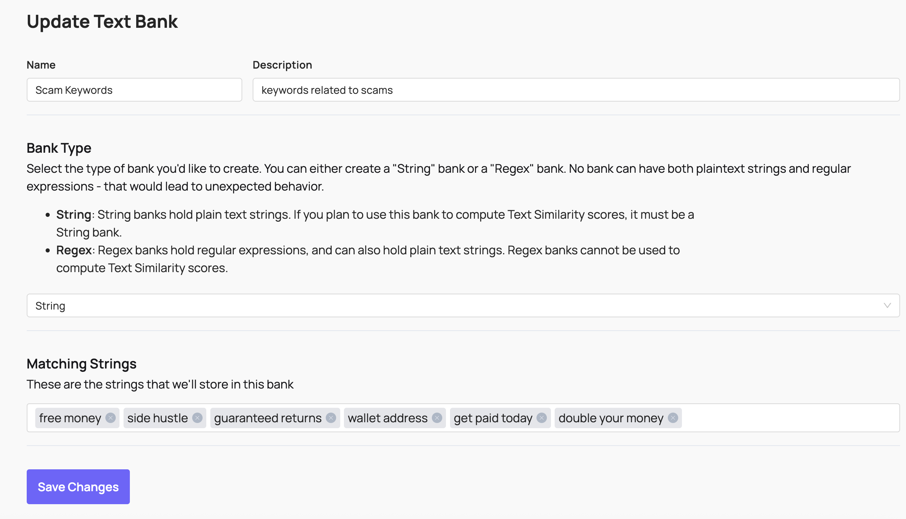
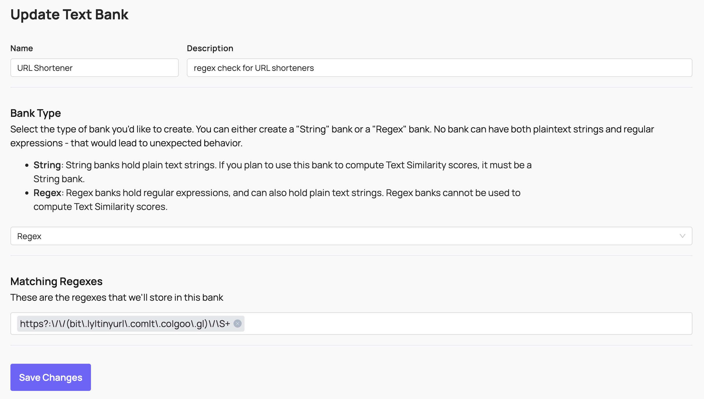

# Automated Routing & Enforcement

Coop supports automatically performing actions on submitted items with [Proactive Rules](#proactive-rules), and routing reports to the correct review queue with [Routing Rules](#routing-rules).

## Rules

Both types of rules are built from the same building blocks: conditions that reference [Signals](signals.md) and [Matching Banks](#matching-banks). Each rule is scoped to one or more item types, so you can have text-based rules for posts and comments, hash-matching rules for images and videos, or location-based rules for user-submitted content with geographic metadata.

Rule conditions can be set to **AND** (all must match for the rule to match) or **OR** (the rule matches when any condition matches).

### Proactive Rules

Proactive Rules automate enforcement. When an item is submitted to Coop, every active Proactive Rule is evaluated against it, and any matching rule's configured action is executed automatically. Configure them under **Automated Enforcement → Proactive Rules**.

All Proactive Rules that match an item fire, not just the first one. This means a single piece of content can trigger multiple automated actions if more than one rule matches.

The action of a Proactive Rule can be set to _Enqueue Item to Manual Review_ which will convert it to a report that will then be matched against Routing Rules in order to send it to the correct queue.

### Routing Rules

Routing Rules direct incoming reports to the correct Review Console queue. Configure them in Coop under **Review Console → Routing**.

Rules are evaluated in order, and a report is routed to the queue of the first matching rule. If no rule matches, the report goes to the default queue. Each rule contains one or more conditions.

Routing Rules only affect where content lands for human review; they don't take enforcement actions. Pair them with [Proactive Rules](#proactive-rules) if you also want automated actions to fire.

## Matching Banks

Matching banks are reusable sets of values you can reference across many rules without repeating yourself. Instead of listing 10,000 banned keywords in every rule that needs them, you define a bank once and reference it wherever needed.

### Text Banks

Text banks hold lists of exact words or phrases, or regular expressions. Use them for keyword matching and pattern detection in text fields.

Coop also supports variant matching to catch evasion attempts, for example treating `h3||0` and `helllllllloooo` as matches for `hello`. See [Signals → Text analysis](signals.md#text-analysis) for details on text signal types.

### Hash Banks

Hash banks hold perceptual fingerprints of known harmful media. Coop uses these in conjunction with HMA to match images and videos against databases of known CSAM, NCII, TVEC, and any custom content you fingerprint. See [Hasher-Matcher-Actioner (HMA)](../integrations/hma.md) for setup.

### Location Banks

Location banks hold lists of [geohashes](https://en.wikipedia.org/wiki/Geohash) or Google Maps Places references. Use them to apply different rules to specific geographic areas, for example stricter content policies on college campuses, or targeted enforcement in particular regions.

For location matching to work, include a geohash in every item you send to Coop representing the location of the user who created the content.

## Signals

Signals are what rule conditions actually evaluate. A signal takes an item field and returns a score, which the rule condition compares against a threshold. See [Signals](signals.md) for more information.
