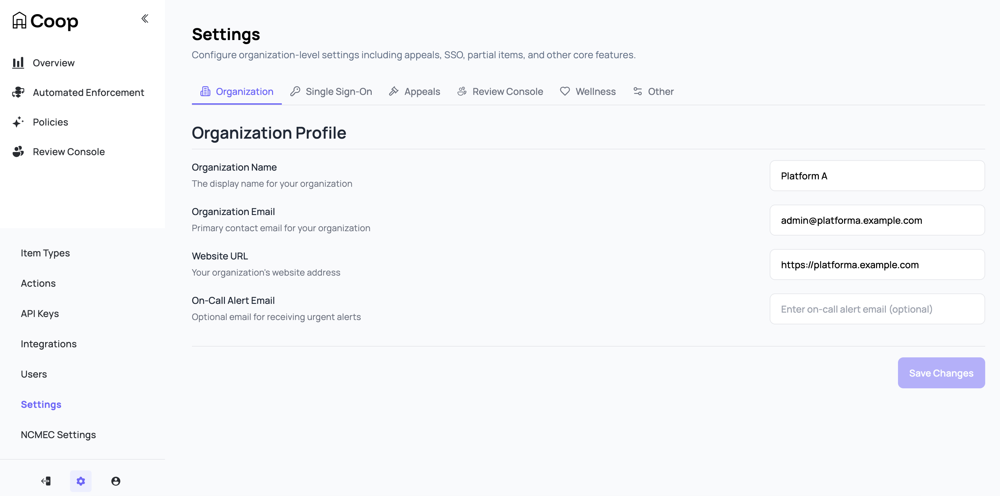
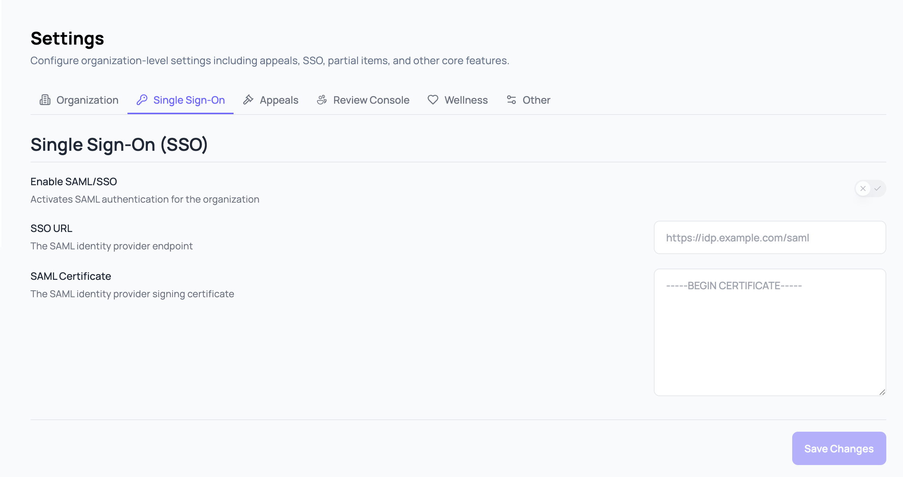
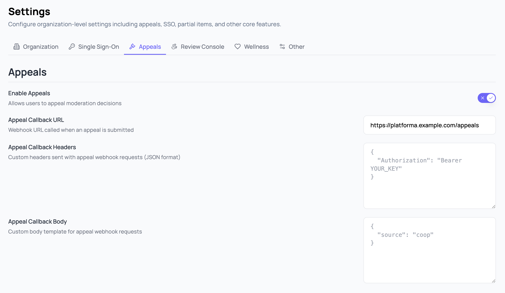
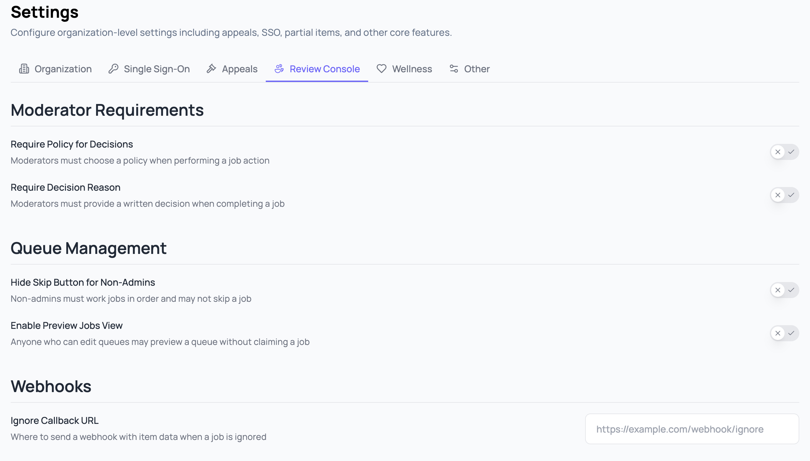
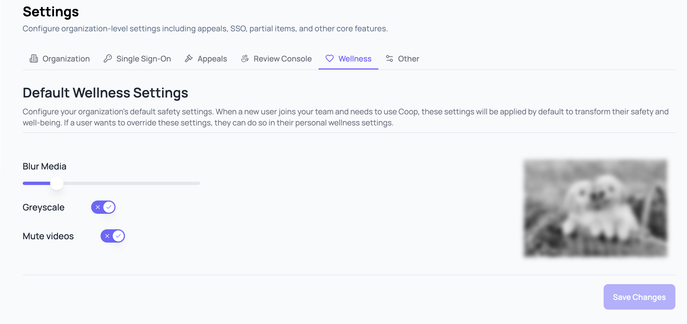
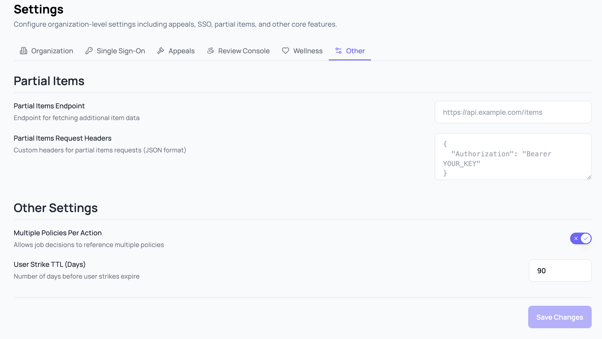

# Organization Settings

Admins configure organization-wide behavior under **Settings**. Most of these settings are off by default, so opt in to the ones you want. Use the side menu to switch between tabs.

## Organization

Identity and contact information for your Coop organization.

| Field               | Purpose                                                                                       |
| :------------------ | :-------------------------------------------------------------------------------------------- |
| Organization Name   | Display name shown across the Coop UI.                                                        |
| Email               | Primary contact for org-related communication.                                                |
| Website URL         | Your platform's public URL. Used in outbound integrations that include a back-reference.      |
| On-Call Alert Email | Optional. Where Coop sends alerts about background-job failures and other operational issues. |

The On-Call Alert Email requires an email service to be integrated with your Coop deployment. Coop supports email service integration but does not ship with one configured.

## Single Sign-On

Enable SAML-based SSO so users authenticate through your identity provider instead of email and password. Coop supports any SAML 2.0 IdP. See [Administration → SSO](administration.md#sso) for the step-by-step Okta setup.

| Field            | Purpose                                             |
| :--------------- | :-------------------------------------------------- |
| Enable SAML/SSO  | Activates SAML authentication for the organization. |
| SSO URL          | The SAML identity provider endpoint.                |
| SAML Certificate | The SAML identity provider signing certificate.     |

## Appeals

Configure how Coop handles user appeals of decisions made in Coop.

| Field                   | Purpose                                                                       |
| :---------------------- | :---------------------------------------------------------------------------- |
| Enable Appeals          | Allows users to appeal decisions made in Coop.                                |
| Appeal Callback URL     | Webhook URL called when an appeal is submitted.                               |
| Appeal Callback Headers | Custom JSON headers sent with the appeal webhook request, for authentication. |
| Appeal Callback Body    | Custom JSON body template merged into the appeal webhook request.             |

## Review Console

Behavior of the [Review Console](review-console.md) for reviewers in your org.

| Field                           | Purpose                                                                                                                              |
| :------------------------------ | :----------------------------------------------------------------------------------------------------------------------------------- |
| Require Policy for Decisions    | Reviewers must choose a policy when performing a job action. Server-side enforced; an API or scripted client cannot bypass it.       |
| Require Decision Reason         | Reviewers must provide a written decision when completing a job. Same server-side enforcement.                                       |
| Hide Skip Button for Non-Admins | Non-admins must work jobs in order and may not skip a job. Admins still see the Skip button.                                         |
| Enable Preview Jobs View        | Anyone who can edit queues may preview a queue without claiming a job. Useful for queue tuning without affecting throughput metrics. |
| Ignore Callback URL             | Where to send a webhook with item data when a reviewer ignores a job.                                                                |

## Wellness

Reviewer wellness controls for content displayed in the Review Console. These help reduce exposure to harmful media during review.

| Field       | Purpose                                                                                                                       |
| :---------- | :---------------------------------------------------------------------------------------------------------------------------- |
| Blur Media  | Default blur strength applied to images and video thumbnails in the Review Console. Reviewers can unblur on a per-item basis. |
| Greyscale   | Renders media in greyscale by default.                                                                                        |
| Mute Videos | Mutes video audio by default in the Review Console.                                                                           |

## Other

Settings that don't fit cleanly into the other tabs.

| Field                         | Purpose                                                                                                                                                                                                      |
| :---------------------------- | :----------------------------------------------------------------------------------------------------------------------------------------------------------------------------------------------------------- |
| Partial Items Endpoint        | Endpoint Coop calls to fetch fresh item data when reviewing or investigating, instead of relying solely on the item submitted at ingest. See [Partial Items](../api/partial-items.md) for the request shape. |
| Partial Items Request Headers | Custom JSON headers sent with partial items requests, for authentication.                                                                                                                                    |
| Multiple Policies Per Action  | Allows job decisions to reference multiple policies. Off by default; one decision typically maps to one policy.                                                                                              |
| User Strike TTL (Days)        | Number of days before a user strike expires. See [User Strikes](automated-enforcement.md#user-strikes) for how strikes accumulate and trigger actions.                                                       |
